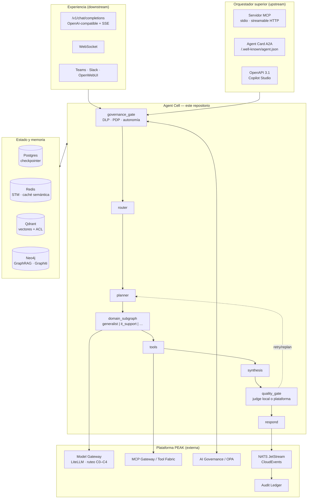

# Agent Forge

> **Célula de agente empresarial reutilizable, multi-tenant y lista para producción.**
> Implementación de referencia de la *célula de dominio* de la arquitectura **PEAK v2.1**
> (Silent4Business · Plataforma de IA Soberana).

Agent Forge no es un demo ni un framework más: es un **producto instalable N veces**.
Cada instalación se llama **Agent Cell** y se adapta a cualquier área o empresa editando
**un solo archivo de perfil** (`agent.profile.yaml`) y su `.env` — sin tocar código.

```bash
make up PROFILE=core            # laptop: agent-api + redis + postgres + litellm + ollama
make new-instance NAME=ventas TENANT=acme-mx   # segunda célula, puertos propios, cero código
```

---

## Qué resuelve

| Necesidad | Cómo |
|---|---|
| Un agente por área (SOC, Ciber, Finanzas, RRHH…) | Subgrafo de dominio intercambiable + perfil declarativo |
| Que aprenda de su área | Memoria STM/LTM/episódica/procedimental por `tenant_id` |
| Que conozca la documentación del área | RAG + CAG + GraphRAG sobre SharePoint/carpetas/S3 |
| Que no filtre lo que no debe | Recuperación *identity-aware* + clasificación C0–C4 + PDP fail-closed |
| Que use herramientas reales | MCP Gateway, n8n, OpenConnector, PostgreSQL/MySQL/MongoDB/Redis |
| Que lo orqueste un modelo superior | La célula se publica como servidor **MCP**, agente **A2A** y **OpenAPI** |
| Que sea auditable | Ledger append-only con hash-chain + evidencia al Audit Ledger central |
| Que no se rompa en silencio | OTel end-to-end, Langfuse, evals con gates en CI |

---

## Arquitectura



Mapeo elemento-por-elemento al diagrama PEAK: [`docs/ARCHITECTURE.md`](docs/ARCHITECTURE.md) y Apéndice C del prompt maestro.

---

## Quickstart

De cero a chat funcionando en menos de 15 minutos: **[QUICKSTART.md](QUICKSTART.md)**.

```bash
uv sync --extra dev              # entorno de desarrollo
cp .env.example .env             # editar secretos
make up PROFILE=core
curl -N localhost:8080/v1/chat/completions \
  -H 'content-type: application/json' \
  -d '{"model":"agent-forge","stream":true,"messages":[{"role":"user","content":"hola"}]}'
```

---

## Comandos

| Comando | Qué hace |
|---|---|
| `make check` | ruff + mypy strict + pytest |
| `make test` | suite completa con cobertura |
| `make up PROFILE=full` | levanta toda la plataforma local |
| `make down` | baja y limpia |
| `make new-instance NAME=x TENANT=y` | genera una célula nueva en `instances/` |
| `make new-connector NAME=x` | esqueleto de conector + tests + doc |
| `make repo-graph` | regenera `docs/graphs/` y `docs/REPO_MAP.md` |
| `make verify-ledger` | valida la cadena de evidencia |
| `make evals` | harness Promptfoo + DeepEval/Ragas |
| `make ingest` | dispara ingesta de conocimiento |

---

## Documentación

- [`docs/ARCHITECTURE.md`](docs/ARCHITECTURE.md) — vistas C4 y mapeo a PEAK
- [`docs/GOVERNANCE.md`](docs/GOVERNANCE.md) — PDP, A0–A4, HITL, fail-closed
- [`docs/KNOWLEDGE.md`](docs/KNOWLEDGE.md) — RAG/CAG/GraphRAG, C0–C4, control de acceso
- [`docs/MEMORY.md`](docs/MEMORY.md) — STM/LTM/episódica/procedimental
- [`docs/CONNECTORS.md`](docs/CONNECTORS.md) · [`docs/CHANNELS.md`](docs/CHANNELS.md) · [`docs/ORCHESTRATORS.md`](docs/ORCHESTRATORS.md)
- [`docs/THREAT_MODEL.md`](docs/THREAT_MODEL.md) · [`docs/WELL_ARCHITECTED.md`](docs/WELL_ARCHITECTED.md)
- [`docs/RUNBOOK.md`](docs/RUNBOOK.md) — operación e incidentes
- [`docs/adr/`](docs/adr/) — decisiones arquitectónicas (MADR)
- [`CLAUDE.md`](CLAUDE.md) — lo primero que debe leer cualquier IA que retome el repo

---

## Licencia

Apache-2.0 — ver [LICENSE](LICENSE).
