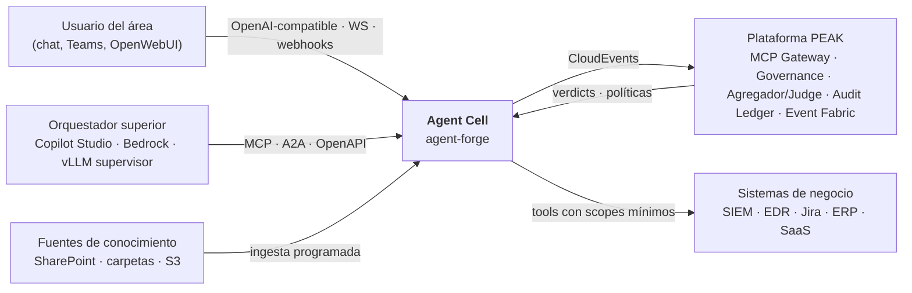
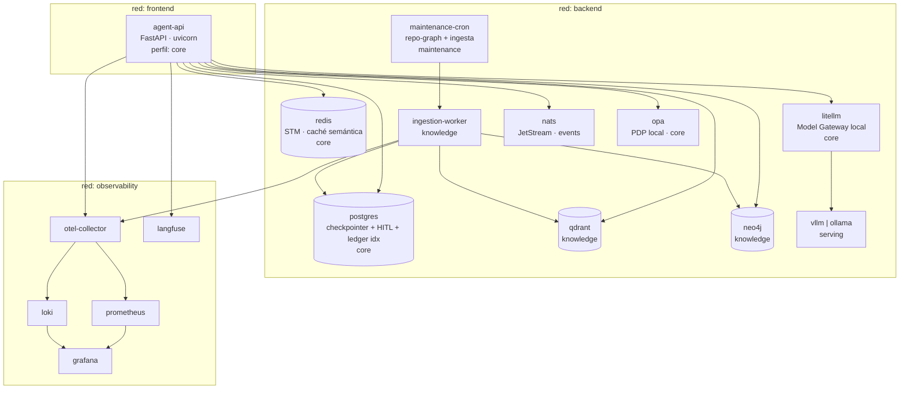
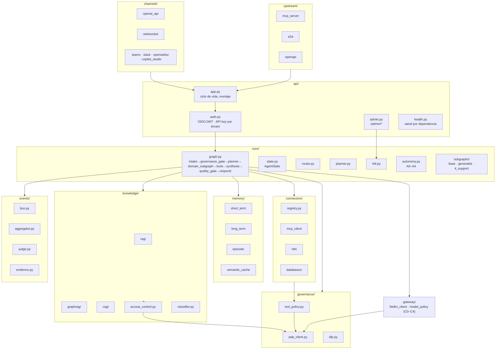
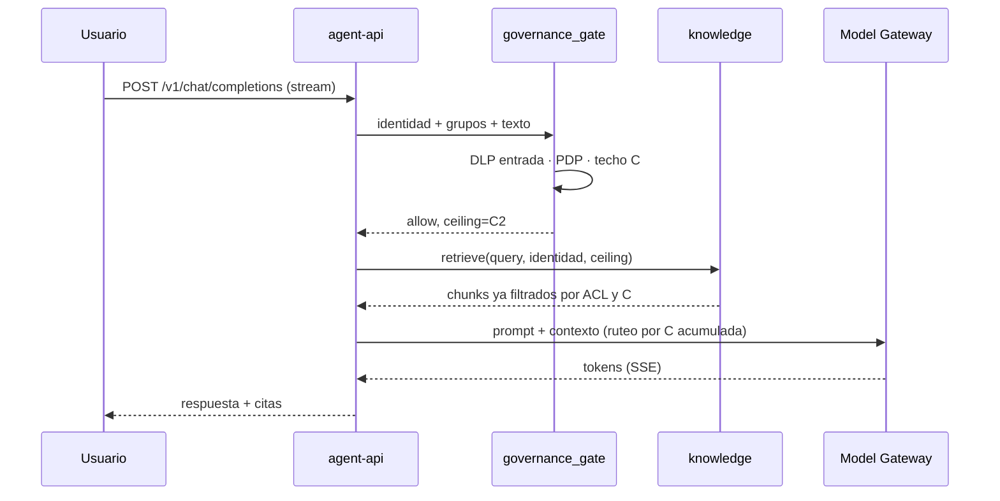
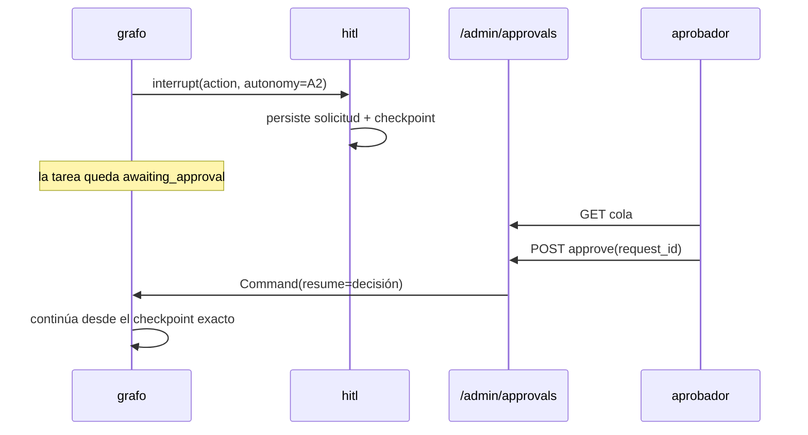
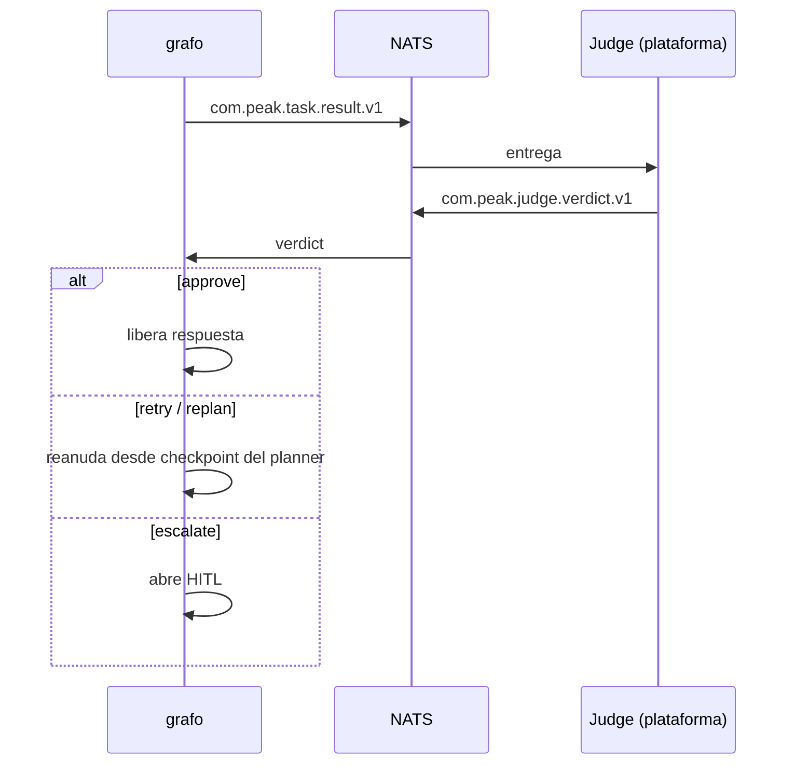

# Arquitectura

Este documento describe **lo que el código hace**. Si una sección y el código discrepan,
el bug está en el documento: corrígelo en el mismo PR.

---

## 1. Qué es una Agent Cell

La *célula de agente* es la unidad repetible de la arquitectura PEAK v2.1: un agente con
su subgrafo de dominio, su memoria, su conocimiento y sus drivers, desplegada una vez por
área de negocio. Este repositorio produce esa célula como **producto configurable**.

Lo que la célula **es**: runtime agéntico local, canales de chat, memoria, conocimiento
identity-aware, conectores, cliente de gobernanza, productor/consumidor de eventos,
ledger local de evidencia.

Lo que la célula **no es** (son servicios de la plataforma, la célula habla sus
contratos y trae fallbacks locales sólo para desarrollo): el MCP Gateway, el Agregador
central, el Judge central, el AI Governance System y el Audit Ledger corporativo.

---

## 2. C4 nivel 1 · Contexto

---

## 3. C4 nivel 2 · Contenedores (`docker compose`)

Reglas de red: `agent-api` es el único contenedor en `frontend`. Ningún almacén publica
puertos al host fuera del perfil `full` en desarrollo. Detalle en
[`DEPLOYMENT.md`](DEPLOYMENT.md).

---

## 4. C4 nivel 3 · Componentes de `agent-api`

---

## 5. El grafo, nodo por nodo

| Nodo | Responsabilidad | Puede detener el flujo |
|---|---|---|
| `intake` | Normaliza el mensaje, resuelve identidad y tenant, abre trace y task | Sí: sin identidad válida el techo de clasificación baja a C0 |
| `governance_gate` | DLP de entrada, decisión PDP de acceso, cálculo del techo de clasificación y del nivel de autonomía efectivo | Sí: `block` termina la tarea con motivo |
| `planner` | Descompone la petición en pasos; es el punto de reentrada de `replan` | No |
| `domain_subgraph` | Lógica del área (plugin). Recupera conocimiento y decide tools | No |
| `tools` | Ejecuta tool calls vía registry; aplica allowlist y autonomía; `interrupt()` si A2+ | Sí: pausa indefinida esperando aprobación |
| `synthesis` | Redacta la respuesta con citas obligatorias cuando hay conocimiento | No |
| `quality_gate` | Judge (local o plataforma): groundedness, seguridad, política. DLP de salida | Sí: `retry`/`replan` reentran; `escalate` abre HITL |
| `respond` | Emite `task.result`, cierra evidencia, devuelve el stream | No |

El estado (`AgentState`) se persiste en cada frontera de nodo mediante el checkpointer.
Un `thread_id` identifica la conversación; un `task_id` identifica la tarea.

---

## 6. Flujos que definen el sistema

### 6.1 Pregunta con conocimiento y cita

### 6.2 Acción A2: pausa por aprobación humana

### 6.3 Veredicto del Judge central

---

## 7. Multi-tenancy

`tenant_id` no es un filtro opcional: es parte de la clave en todos los almacenes.

| Almacén | Namespacing |
|---|---|
| Redis | prefijo `af:{tenant}:{instance}:` en toda clave |
| Postgres | columna `tenant_id` con índice; checkpointer usa `thread_id` prefijado |
| Qdrant | campo de payload `tenant_id` indexado y obligatorio en el filtro |
| Neo4j | propiedad `tenant_id` en cada nodo y relación |
| NATS | sujeto `peak.{tenant}.{type}` |
| Ledger | un fichero por tenant, cadena de hash independiente |

Dos instancias corren lado a lado en el mismo host porque además del tenant, el
`AGENT_FORGE_INSTANCE` entra en el prefijo y en los puertos publicados.

---

## 8. Clasificación de datos C0–C4

| Nivel | Significado | Modelos permitidos |
|---|---|---|
| C0 | Público | Locales y externos gobernados |
| C1 | Interno | Locales y externos gobernados |
| C2 | Confidencial | Locales; externos sólo desensibilizado |
| C3 | Restringido | **Sólo locales** |
| C4 | Secreto | **Sólo locales** |

La clasificación **se acumula**: el techo de una tarea es el máximo de la clasificación
de la petición, de cada chunk recuperado y de cada resultado de tool. El enrutado del
modelo se decide con ese máximo, en `gateway/model_policy.py`, que es el **único** punto
del código que elige backend.

---

## 9. Mapeo al diagrama PEAK v2.1

| Elemento del diagrama | En este repositorio |
|---|---|
| Agente + Subgrafo por área | `core/graph.py` + `core/subgraphs/` |
| Agentic Graph Runtime | LangGraph + checkpointer + `core/hitl.py` |
| Redis / Estado y Memoria | `memory/` + checkpointer Redis |
| Router / Planner | `core/router.py` · `core/planner.py` |
| MCP Gateway / Tool Fabric | Consumido por `connectors/mcp_client/` |
| Model Gateway | LiteLLM + `gateway/model_policy.py` + `governance/dlp.py` |
| Inferencia local / externos gobernados | Perfil `serving` + backends LiteLLM |
| Agregador / Judge / retry-replan | `events/aggregator.py` · `events/judge.py` |
| Aprobación humana HITL (A0–A4) | `core/autonomy.py` + `/admin/approvals` |
| Evidence / Audit Ledger | `events/evidence.py` + `scripts/verify_ledger.py` |
| Broker / Event Fabric | NATS JetStream + `events/bus.py` |
| Plataforma de conocimiento | `knowledge/` (Qdrant, Neo4j, LightRAG, Docling) |
| Wrapper / gobernanza en canales | `governance/dlp.py` aplicado en `channels/` y `api/` |
| SIEM / EDR / Telemetría | Tools vía MCP Gateway + OTel |

---

## 10. Decisiones registradas

[ADR-001](adr/ADR-001-agentic-framework.md) LangGraph ·
[ADR-002](adr/ADR-002-memory-architecture.md) memoria ·
[ADR-003](adr/ADR-003-event-broker.md) NATS ·
[ADR-004](adr/ADR-004-vector-store.md) Qdrant ·
[ADR-005](adr/ADR-005-dependency-tiering.md) extras ·
[ADR-006](adr/ADR-006-dlp-stack.md) DLP.
