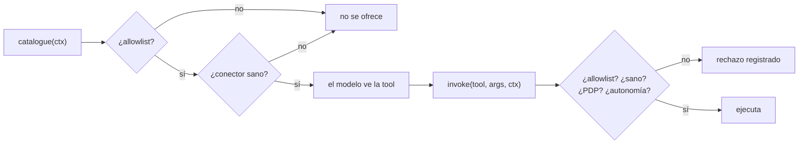

# Conectores

Un conector expone capacidades externas como **tools** tipadas. El core nunca importa un
conector: los descubre por entry points y los consume por el `Protocol` `BaseConnector`.

---

## 1. El contrato

```python
class ToolSpec(BaseModel):
    name: str
    description: str
    input_schema: dict
    required_scope: str
    autonomy_min: AutonomyLevel          # por defecto A2
    max_classification: Classification   # por defecto C4
    readonly: bool

class CallContext(BaseModel):
    tenant_id: str
    user_id: str
    groups: tuple[str, ...]
    classification_ceiling: Classification
    trace_id: str
    task_id: str
    autonomy_granted: AutonomyLevel

class ToolResult(BaseModel):
    ok: bool
    data: dict | None
    error: str | None
    classification: Classification       # por defecto C4
    evidence_digest: str | None

class BaseConnector(Protocol):
    name: str
    version: str
    async def health(self) -> bool: ...
    def capabilities(self) -> Sequence[ToolSpec]: ...
    async def invoke(self, tool: str, args: dict, ctx: CallContext) -> ToolResult: ...
    async def aclose(self) -> None: ...
```

### Los tres defaults que importan

Van deliberadamente en la dirección segura, porque el registry **no puede comprobar
honestidad**:

| Campo | Default | Por qué |
|---|---|---|
| `autonomy_min` | **A2** | Quien olvida pensar en autonomía obtiene aprobación humana, no ejecución silenciosa. El nivel efectivo es el máximo de este valor, el perfil y el PDP: declararlo bajo es la única forma de saltarse el HITL. |
| `ToolResult.classification` | **C4** | Un resultado sin clasificar no puede tratarse como público. Sobre-clasificar cuesta una llamada al modelo local; sub-clasificar es una fuga. |
| `health()` | Debe **sondear de verdad** | Sin health verde el conector no se registra y sus tools no existen para el modelo. Un falso positivo hace que el modelo vea herramientas que van a fallar. |

`ConnectorBase` aporta el resto (timeout, circuit breaker, cronometraje, digest de
argumentos) para que un autor de conector no lo reimplemente y lo haga sutilmente mal.

---

## 2. Registry: dos comprobaciones, a propósito



* **Al construir el catálogo**: una tool que el tenant no puede usar nunca se le ofrece al
  modelo. Un modelo no puede usar mal una herramienta de la que no le han hablado.
* **Justo antes de invocar**: entre ambas pasa tiempo y la política puede cambiar. Esta
  segunda es la que realmente protege; la primera evita que el modelo lo intente.

El catálogo es **por petición**, no por célula: depende del techo de clasificación del
solicitante y de qué conectores están sanos en ese momento.

Una tool que no está en el catálogo se **rechaza directamente**, no se pausa para
aprobación: pedirle a una persona que autorice una herramienta que no existe le hace
perder el tiempo, y la acción fallaría igualmente después.

### Allowlist

Glob por tenant desde el perfil (`connectors.mcp_gateway.allowlist`). **Una allowlist
vacía no permite nada**, no lo permite todo: un perfil que olvida declarar sus tools
produce un agente que no puede actuar, que es la dirección segura en la que fallar.

Las tools propias de la célula (`repo_graph.query`) están siempre disponibles: leen el
estado de la propia célula, no sistemas del tenant.

---

## 3. Conectores incluidos

| Conector | Qué hace |
|---|---|
| `mcp` | Cliente MCP multi-transporte (streamable HTTP, SSE, stdio) contra el MCP Gateway de la plataforma. Reexpone las tools remotas con prefijo, siempre C4 y al nivel de autonomía configurado: la anotación del gateway es **orientativa**, la célula es la responsable. |
| `n8n` | Dispara workflows por webhook y espera el callback por `correlation_id`. Un workflow que no responde a tiempo se reporta como *aceptado y en curso*, nunca como terminado. |
| `api.<servicio>` | OpenConnector: genera tools desde un spec OpenAPI. Autonomía derivada del verbo (GET→A0, escritura→A2, DELETE→A3); un spec no puede negociar un nivel más bajo. |
| `postgres` `mysql` `mongodb` `redis` | Plantillas parametrizadas allowlisted. El modelo elige plantilla y argumentos; **no existe una ruta de código que acepte una consulta de quien llama**. |
| `repo_graph` | `repo_graph.query`: el agente responde sobre su propio repositorio (RF-12). A0 y C1. |

### Bases de datos: por qué no hay SQL del modelo

Cada plantilla declara sus parámetros, si escribe (lo que fija el suelo de autonomía: A0
para lectura, A3 para escritura) y la clasificación de lo que devuelve.

* Un argumento que la plantilla no declara **se descarta** antes de llegar al driver.
* Una plantilla que usa un placeholder que no declara **se rechaza al construir**.
* Una plantilla de escritura sobre una conexión `readonly` **se rechaza al construir**.
* En Mongo la estructura del filtro viene de la plantilla; los argumentos sólo rellenan
  hojas, así que no pueden introducir un operador.

### n8n: el callback

Un workflow no es una llamada a función: tarda, puede involucrar a una persona y responde
fuera de banda. El conector dispara con un `correlation_id` y espera; el callback llega a
`POST /channels/n8n/callback` autenticado con la API key del tenant, y resuelve la llamada
que dejó al grafo esperando.

Un callback que llega cuando ya nadie espera **se conserva**, no se descarta: que el
esperador agotara su plazo no significa que el workflow no se ejecutara.

---

## 4. Añadir uno

```bash
make new-connector NAME=servicenow
```

Genera el módulo, el entry point, el test de contrato y la fila de documentación. **El
código generado pasa lint y sus tests antes de que edites una línea**: lo aburrido ya está
bien, y lo que queda es lo único que tú sabes —qué hace el sistema y cuán sensibles son
sus respuestas.

Después:

1. `uv sync` para registrar el entry point.
2. Ajusta `capabilities()`: `autonomy_min` y `max_classification` **reales**.
3. `make check`.

El test generado corre la misma batería que todos: el esquema de capacidades es válido, un
error del backend se convierte en resultado fallido y no en excepción, una tool
desconocida se rechaza, y el nombre expuesto al modelo es válido.

---

## 5. Seguridad

* Scopes mínimos: se pide el permiso más pequeño que permita funcionar.
* Sin credenciales en el código: todo por variable de entorno referenciada desde el perfil
  (`dsn_env`). Un conector generado desde un spec **nunca** toma credenciales del spec.
* Conexiones de base de datos `readonly` salvo declaración explícita.
* Timeout y circuit breaker en todo I/O externo, vía el helper `guard`.
* La identidad del usuario final viaja al MCP Gateway bajo una clave propia
  (`_agentforge`), no mezclada con los argumentos de la tool: una tool remota no debe
  poder declarar un parámetro `user_id` y recibir algo que luego pueda suplantar.
* Todo `invoke()` deja registro con el **digest** de los argumentos, nunca los valores.
