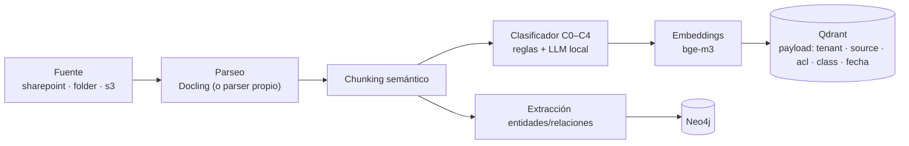

# Conocimiento: RAG + CAG + GraphRAG

## 1. Pipeline de ingesta



La clasificación se calcula **en la ingesta**, no en la consulta, y viaja pegada a cada
chunk. Reglas primero (patrones, ruta de origen, etiqueta de sensibilidad heredada del
sitio de SharePoint), LLM local después para lo ambiguo, y **override manual** siempre
disponible. Un chunk sin clasificación determinable se marca al nivel por defecto del
perfil (`knowledge.default_classification`), nunca C0.

## 2. Fuentes

| Tipo | Sincronización | Extra requerido |
|---|---|---|
| `folder` | Recorrido + mtime | ninguno |
| `sharepoint` | Microsoft Graph **delta queries** (incremental) | `sources` |
| `s3` | Listado + ETag | `sources` |

Programables por perfil con `sync_cron`. El worker de ingesta corre en el perfil
`knowledge`; el cron en `maintenance`.

## 3. Payload de un chunk

```jsonc
{
  "tenant_id": "acme-mx",
  "source_id": "sharepoint://sites/finanzas/Documentos/politica-viaticos.pdf",
  "chunk_id": "…#p3",
  "acl_groups": ["finanzas", "finanzas-lideres"],
  "acl_users": [],
  "classification": "C2",
  "updated_at": "2026-08-14T10:02:11Z",
  "title": "Política de viáticos",
  "text": "…"
}
```

`tenant_id`, `acl_groups` y `classification` son **campos indexados** en Qdrant: el
filtro se evalúa durante la búsqueda, no después (ADR-004).

## 4. Control de acceso identity-aware

`knowledge/access_control.py` es el **único** lugar que traduce (identidad, grupos,
techo de clasificación, decisión del PDP) a un filtro de almacén. Ninguna capa superior
construye filtros a mano.

Condición aplicada:

```
tenant_id == ctx.tenant_id
AND classification <= ctx.classification_ceiling
AND (acl_groups ∩ ctx.groups ≠ ∅ OR ctx.user_id ∈ acl_users)
AND source_id ∉ pdp.denied_sources
```

**Un usuario sin permiso recibe cero resultados y ninguna señal de existencia**: la
respuesta es idéntica a la de un corpus vacío. Sin identidad verificada el techo baja a
C0 automáticamente.

## 5. Retrieval híbrido

BM25 + vectorial + grafo, fusionados con **RRF**, y re-ranking con
`bge-reranker-v2-m3`. El filtro de acceso se aplica en **cada** rama antes de la fusión;
fusionar primero y filtrar después reintroduciría exactamente la fuga que la sección 4
cierra.

`knowledge.rag.top_k` y `rerank` se configuran por perfil.

## 6. Citas

Toda respuesta apoyada en conocimiento lleva citas `source_id#chunk_id`. Si el
`quality_gate` detecta afirmaciones sin cita (groundedness bajo umbral), el veredicto es
`retry` con instrucción de citar o de admitir desconocimiento. No hay modo "responder
sin citar" para contenido recuperado.

## 7. GraphRAG

Extracción de entidades y relaciones a Neo4j; consultas globales (temas, comunidades) y
locales (vecindario de una entidad) vía LightRAG. Cada nodo y relación lleva
`tenant_id`. Se activa con `knowledge.graphrag.enabled`.

## 8. CAG

El corpus estable declarado en `knowledge.cag.stable_corpus` se precarga en el contexto
del sistema y se apoya en el prefix caching de vLLM. Evita retrieval para preguntas
sobre documentos que casi nunca cambian (políticas, procedimientos). Complementado con
la caché semántica de `memory/semantic_cache.py`.

## 9. Umbral de relevancia

La búsqueda por vecino más cercano **siempre** devuelve algo. Preguntar por una receta de
paella a un agente de Finanzas devolvía la política de viáticos, y el modelo podía
citarla. Una cita a un documento irrelevante es peor que ninguna cita.

El re-ranker produce una cobertura normalizada (0–1) de los términos de la consulta, y el
retriever descarta lo que quede por debajo de `MIN_RELEVANCE` (0.15). El umbral se aplica
sólo sobre esa puntuación: los valores de RRF no son comparables entre corpus, y por eso
el re-ranking está activo por defecto.

## 10. Sin extras instalados

Sin el extra `knowledge` (ADR-005) siguen funcionando: parser de texto plano y Markdown,
almacén vectorial en memoria, grafo en memoria, BM25 y embeddings por *feature hashing*
sobre palabras y trigramas de caracteres. Nada de eso es un stub —el hashing es una
técnica real, determinista y sin dependencias— pero sí es **léxico**: acierta
reformulaciones casi idénticas y falla las paráfrasis. Suficiente para desarrollo y para
los tests; insuficiente para producción, y `/health` lo dice explícitamente.

## 11. Endpoints

| Endpoint | Qué hace |
|---|---|
| `POST /admin/ingest[?source=folder]` | Sincroniza ahora y devuelve el informe por fuente |
| `GET /admin/knowledge` | Tamaño del corpus, configuración y forma de la última recuperación |

Desde la línea de comandos: `make ingest` (o `scripts/ingest.py --dry-run` para ver qué
fuentes están configuradas sin tocarlas) y `make seed` para un corpus de demostración con
ACLs mixtas, que hace visible el control de acceso desde el primer minuto.
