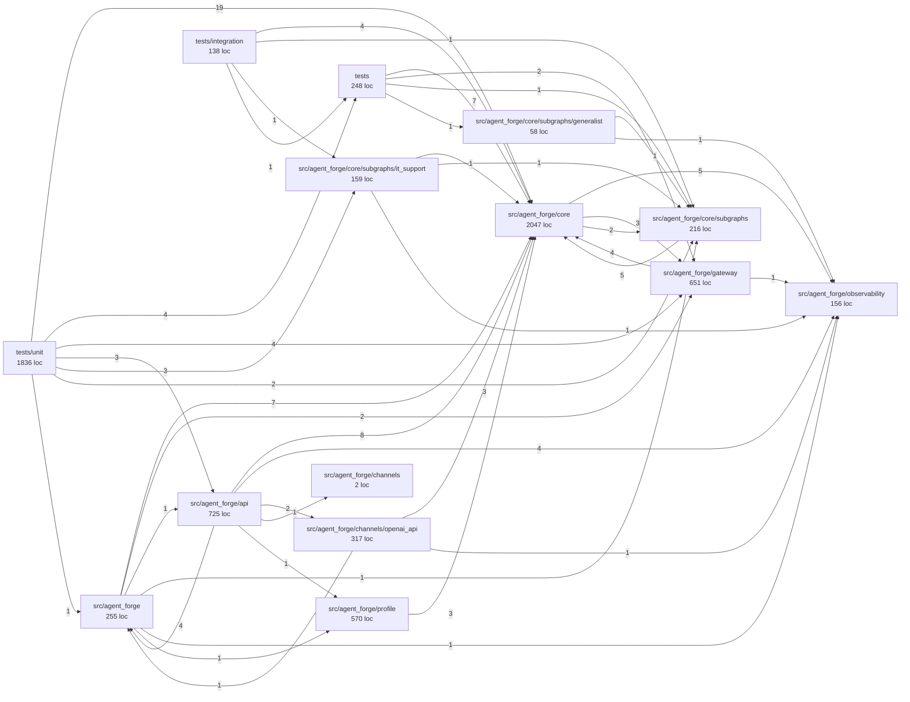

# Mapa del repositorio

> **Archivo generado por `make repo-graph`.** No lo edites a mano: el próximo
> `make repo-graph` sobrescribirá los cambios. La fuente de verdad es el código.

## Resumen

- Módulos Python: **76**
- Líneas de código: **8052**
- Clases: **107** · Funciones y métodos de nivel superior: **264**
- Dependencias externas importadas directamente: **39**

## Dependencias entre paquetes

## Módulos

### `scripts`

| Módulo | Descripción | LOC | Símbolos |
|---|---|---:|---|
| [`coverage_gate.py`](../scripts/coverage_gate.py) | Enforce a per-package coverage floor from coverage.xml. | 85 | `package_coverage`, `main` |
| [`docs_check.py`](../scripts/docs_check.py) | Verify that every document required by the spec exists and is not a stub. | 170 | `check_file`, `_strip_code`, `_has_heading`, `check_adrs`, `check_decisions_log_per_phase`, `main` |
| [`repo_graph.py`](../scripts/repo_graph.py) | Build a knowledge graph of this repository from its AST. | 365 | `Symbol`, `Module`, `_decorator_name`, `_first_line`, `parse_module`, `discover` (+9) |

### `src/agent_forge`

| Módulo | Descripción | LOC | Símbolos |
|---|---|---:|---|
| [`__init__.py`](../src/agent_forge/__init__.py) | Agent Forge - reusable enterprise agent cell for the PEAK architecture. | 7 | — |
| [`runtime.py`](../src/agent_forge/runtime.py) | Composition root: turns a profile plus an environment into a running cell. | 248 | `installed_capabilities`, `Settings`, `Runtime`, `check_capabilities`, `load_model_policy`, `build_runtime` |

### `src/agent_forge/analytics`

| Módulo | Descripción | LOC | Símbolos |
|---|---|---:|---|
| [`__init__.py`](../src/agent_forge/analytics/__init__.py) | Agent Forge package. | 2 | — |

### `src/agent_forge/api`

| Módulo | Descripción | LOC | Símbolos |
|---|---|---:|---|
| [`__init__.py`](../src/agent_forge/api/__init__.py) | HTTP surface: application assembly, auth, admin and health. | 16 | `__getattr__` |
| [`admin.py`](../src/agent_forge/api/admin.py) | Administration and operation API. | 280 | `ApprovalDecision`, `require_authenticated`, `effective_config`, `list_approvals`, `decide_approval`, `task_status` (+3) |
| [`app.py`](../src/agent_forge/api/app.py) | FastAPI application: assembly and lifecycle. | 118 | `create_app`, `_mount_channels`, `_install_cors`, `_install_error_handlers` |
| [`auth.py`](../src/agent_forge/api/auth.py) | Authentication and identity resolution. | 223 | `parse_api_keys`, `AuthSettings`, `Authenticator`, `_bearer`, `_claim_list`, `verify_slack_signature` |
| [`health.py`](../src/agent_forge/api/health.py) | Health endpoints. | 88 | `live`, `health`, `ready`, `_run_probes`, `_probe` |

### `src/agent_forge/channels`

| Módulo | Descripción | LOC | Símbolos |
|---|---|---:|---|
| [`__init__.py`](../src/agent_forge/channels/__init__.py) | Agent Forge package. | 2 | — |

### `src/agent_forge/channels/copilot_studio`

| Módulo | Descripción | LOC | Símbolos |
|---|---|---:|---|
| [`__init__.py`](../src/agent_forge/channels/copilot_studio/__init__.py) | Agent Forge package. | 2 | — |

### `src/agent_forge/channels/openai_api`

| Módulo | Descripción | LOC | Símbolos |
|---|---|---:|---|
| [`__init__.py`](../src/agent_forge/channels/openai_api/__init__.py) | OpenAI-compatible chat channel. | 317 | `ChatMessage`, `ChatCompletionRequest`, `get_runtime`, `resolve_identity`, `list_models`, `chat_completions` (+9) |

### `src/agent_forge/channels/openwebui`

| Módulo | Descripción | LOC | Símbolos |
|---|---|---:|---|
| [`__init__.py`](../src/agent_forge/channels/openwebui/__init__.py) | Agent Forge package. | 2 | — |

### `src/agent_forge/channels/slack`

| Módulo | Descripción | LOC | Símbolos |
|---|---|---:|---|
| [`__init__.py`](../src/agent_forge/channels/slack/__init__.py) | Agent Forge package. | 2 | — |

### `src/agent_forge/channels/teams`

| Módulo | Descripción | LOC | Símbolos |
|---|---|---:|---|
| [`__init__.py`](../src/agent_forge/channels/teams/__init__.py) | Agent Forge package. | 2 | — |

### `src/agent_forge/channels/websocket`

| Módulo | Descripción | LOC | Símbolos |
|---|---|---:|---|
| [`__init__.py`](../src/agent_forge/channels/websocket/__init__.py) | Agent Forge package. | 2 | — |

### `src/agent_forge/connectors`

| Módulo | Descripción | LOC | Símbolos |
|---|---|---:|---|
| [`__init__.py`](../src/agent_forge/connectors/__init__.py) | Agent Forge package. | 2 | — |

### `src/agent_forge/connectors/databases`

| Módulo | Descripción | LOC | Símbolos |
|---|---|---:|---|
| [`__init__.py`](../src/agent_forge/connectors/databases/__init__.py) | Agent Forge package. | 2 | — |

### `src/agent_forge/connectors/mcp_client`

| Módulo | Descripción | LOC | Símbolos |
|---|---|---:|---|
| [`__init__.py`](../src/agent_forge/connectors/mcp_client/__init__.py) | Agent Forge package. | 2 | — |

### `src/agent_forge/connectors/n8n`

| Módulo | Descripción | LOC | Símbolos |
|---|---|---:|---|
| [`__init__.py`](../src/agent_forge/connectors/n8n/__init__.py) | Agent Forge package. | 2 | — |

### `src/agent_forge/connectors/openconnector`

| Módulo | Descripción | LOC | Símbolos |
|---|---|---:|---|
| [`__init__.py`](../src/agent_forge/connectors/openconnector/__init__.py) | Agent Forge package. | 2 | — |

### `src/agent_forge/core`

| Módulo | Descripción | LOC | Símbolos |
|---|---|---:|---|
| [`__init__.py`](../src/agent_forge/core/__init__.py) | Domain-neutral kernel: graph, state, autonomy, classification, errors. | 14 | — |
| [`autonomy.py`](../src/agent_forge/core/autonomy.py) | Autonomy levels A0-A4 and the rule that resolves the effective one. | 128 | `AutonomyLevel`, `resolve`, `AutonomyMap` |
| [`checkpointer.py`](../src/agent_forge/core/checkpointer.py) | Checkpointer selection. | 89 | `CheckpointerError`, `namespaced_thread_id`, `open_checkpointer` |
| [`classification.py`](../src/agent_forge/core/classification.py) | Data classification C0-C4. | 93 | `Classification`, `accumulate`, `is_within`, `coerce_payload` |
| [`errors.py`](../src/agent_forge/core/errors.py) | Domain errors. | 138 | `AgentForgeError`, `ProfileError`, `CapabilityUnavailableError`, `AuthenticationError`, `AuthorizationError`, `PolicyDeniedError` (+7) |
| [`graph.py`](../src/agent_forge/core/graph.py) | The agentic graph. | 596 | `GateOutcome`, `identity_gate`, `GraphDeps`, `_digest`, `_intake`, `_governance_gate` (+14) |
| [`hitl.py`](../src/agent_forge/core/hitl.py) | Human in the loop. | 228 | `Approver`, `ApprovalPolicy`, `PendingApproval`, `ApprovalStore`, `InMemoryApprovalStore`, `build_request` (+4) |
| [`planner.py`](../src/agent_forge/core/planner.py) | Planner: decomposes a request into steps. | 178 | `PlanRequest`, `Planner`, `parse_plan`, `_drop_unknown_tools`, `_single_step`, `_with_feedback` (+1) |
| [`prompts.py`](../src/agent_forge/core/prompts.py) | Versioned prompt registry. | 158 | `PromptError`, `Prompt`, `PromptRegistry`, `_load_prompt` |
| [`router.py`](../src/agent_forge/core/router.py) | Intent router. | 144 | `normalise`, `RouteDecision`, `IntentRouter` |
| [`state.py`](../src/agent_forge/core/state.py) | ``AgentState``: everything the graph carries between nodes. | 281 | `_now`, `_new_id`, `_Model`, `Identity`, `Message`, `Citation` (+9) |

### `src/agent_forge/core/subgraphs`

| Módulo | Descripción | LOC | Símbolos |
|---|---|---:|---|
| [`__init__.py`](../src/agent_forge/core/subgraphs/__init__.py) | Agent Forge package. | 2 | — |
| [`base.py`](../src/agent_forge/core/subgraphs/base.py) | The domain subgraph contract. | 214 | `SubgraphError`, `ToolDescriptor`, `Finding`, `ToolRequest`, `DomainContext`, `DomainOutcome` (+4) |

### `src/agent_forge/core/subgraphs/generalist`

| Módulo | Descripción | LOC | Símbolos |
|---|---|---:|---|
| [`__init__.py`](../src/agent_forge/core/subgraphs/generalist/__init__.py) | Generalist domain subgraph: the default, deliberately domain-free. | 58 | `GeneralistSubgraph` |

### `src/agent_forge/core/subgraphs/it_support`

| Módulo | Descripción | LOC | Símbolos |
|---|---|---:|---|
| [`__init__.py`](../src/agent_forge/core/subgraphs/it_support/__init__.py) | IT support subgraph: a worked example of what specialisation buys you. | 159 | `ItSupportSubgraph` |

### `src/agent_forge/events`

| Módulo | Descripción | LOC | Símbolos |
|---|---|---:|---|
| [`__init__.py`](../src/agent_forge/events/__init__.py) | Agent Forge package. | 2 | — |

### `src/agent_forge/events/schemas`

| Módulo | Descripción | LOC | Símbolos |
|---|---|---:|---|
| [`__init__.py`](../src/agent_forge/events/schemas/__init__.py) | Agent Forge package. | 2 | — |

### `src/agent_forge/gateway`

| Módulo | Descripción | LOC | Símbolos |
|---|---|---:|---|
| [`__init__.py`](../src/agent_forge/gateway/__init__.py) | Model gateway: routing by data classification, then transport. | 36 | — |
| [`litellm_client.py`](../src/agent_forge/gateway/litellm_client.py) | Model gateway: the only way the cell talks to a language model. | 340 | `ChatRequest`, `ChatChunk`, `ChatResponse`, `ModelTransport`, `LiteLLMTransport`, `GovernedGateway` (+2) |
| [`model_policy.py`](../src/agent_forge/gateway/model_policy.py) | Model routing by data classification. | 275 | `Sovereignty`, `ModelBackend`, `RoutingDecision`, `ModelPolicy`, `_parse_ceiling` |

### `src/agent_forge/governance`

| Módulo | Descripción | LOC | Símbolos |
|---|---|---:|---|
| [`__init__.py`](../src/agent_forge/governance/__init__.py) | Agent Forge package. | 2 | — |

### `src/agent_forge/knowledge`

| Módulo | Descripción | LOC | Símbolos |
|---|---|---:|---|
| [`__init__.py`](../src/agent_forge/knowledge/__init__.py) | Agent Forge package. | 2 | — |

### `src/agent_forge/knowledge/cag`

| Módulo | Descripción | LOC | Símbolos |
|---|---|---:|---|
| [`__init__.py`](../src/agent_forge/knowledge/cag/__init__.py) | Agent Forge package. | 2 | — |

### `src/agent_forge/knowledge/graphrag`

| Módulo | Descripción | LOC | Símbolos |
|---|---|---:|---|
| [`__init__.py`](../src/agent_forge/knowledge/graphrag/__init__.py) | Agent Forge package. | 2 | — |

### `src/agent_forge/knowledge/ingestion`

| Módulo | Descripción | LOC | Símbolos |
|---|---|---:|---|
| [`__init__.py`](../src/agent_forge/knowledge/ingestion/__init__.py) | Agent Forge package. | 2 | — |

### `src/agent_forge/knowledge/rag`

| Módulo | Descripción | LOC | Símbolos |
|---|---|---:|---|
| [`__init__.py`](../src/agent_forge/knowledge/rag/__init__.py) | Agent Forge package. | 2 | — |

### `src/agent_forge/knowledge/sources`

| Módulo | Descripción | LOC | Símbolos |
|---|---|---:|---|
| [`__init__.py`](../src/agent_forge/knowledge/sources/__init__.py) | Agent Forge package. | 2 | — |

### `src/agent_forge/memory`

| Módulo | Descripción | LOC | Símbolos |
|---|---|---:|---|
| [`__init__.py`](../src/agent_forge/memory/__init__.py) | Agent Forge package. | 2 | — |

### `src/agent_forge/observability`

| Módulo | Descripción | LOC | Símbolos |
|---|---|---:|---|
| [`__init__.py`](../src/agent_forge/observability/__init__.py) | Agent Forge package. | 2 | — |
| [`logging.py`](../src/agent_forge/observability/logging.py) | Structured logging. | 154 | `redact_sensitive`, `_redact_mapping`, `add_service_context`, `configure_logging`, `get_logger`, `bind_request_context` (+2) |

### `src/agent_forge/profile`

| Módulo | Descripción | LOC | Símbolos |
|---|---|---:|---|
| [`__init__.py`](../src/agent_forge/profile/__init__.py) | Instance profile: the single artefact that distinguishes one Agent Cell from another. | 21 | — |
| [`loader.py`](../src/agent_forge/profile/loader.py) | Load, expand and validate an ``agent.profile.yaml``. | 142 | `expand_env`, `load_profile`, `parse_profile`, `_deep_merge`, `format_profile_error` |
| [`models.py`](../src/agent_forge/profile/models.py) | Typed model of ``agent.profile.yaml``. | 407 | `_Base`, `Identity`, `Domain`, `Autonomy`, `ChannelToggle`, `Channels` (+29) |

### `src/agent_forge/upstream`

| Módulo | Descripción | LOC | Símbolos |
|---|---|---:|---|
| [`__init__.py`](../src/agent_forge/upstream/__init__.py) | Agent Forge package. | 2 | — |

### `src/agent_forge/upstream/a2a`

| Módulo | Descripción | LOC | Símbolos |
|---|---|---:|---|
| [`__init__.py`](../src/agent_forge/upstream/a2a/__init__.py) | Agent Forge package. | 2 | — |

### `src/agent_forge/upstream/mcp_server`

| Módulo | Descripción | LOC | Símbolos |
|---|---|---:|---|
| [`__init__.py`](../src/agent_forge/upstream/mcp_server/__init__.py) | Agent Forge package. | 2 | — |

### `src/agent_forge/upstream/openapi`

| Módulo | Descripción | LOC | Símbolos |
|---|---|---:|---|
| [`__init__.py`](../src/agent_forge/upstream/openapi/__init__.py) | Agent Forge package. | 2 | — |

### `tests`

| Módulo | Descripción | LOC | Símbolos |
|---|---|---:|---|
| [`__init__.py`](../tests/__init__.py) | Agent Forge test suite. | 2 | — |
| [`conftest.py`](../tests/conftest.py) | Shared pytest fixtures. | 69 | `repo_root`, `sample_package`, `pytest_asyncio_loop_factories` |
| [`support.py`](../tests/support.py) | Test doubles that satisfy the same Protocols as the production implementations. | 177 | `FakeTransport`, `FakeRetrievalResult`, `fake_retriever`, `make_policy`, `make_gateway`, `make_prompts` (+2) |

### `tests/e2e`

| Módulo | Descripción | LOC | Símbolos |
|---|---|---:|---|
| [`__init__.py`](../tests/e2e/__init__.py) | Agent Forge test suite. | 2 | — |

### `tests/integration`

| Módulo | Descripción | LOC | Símbolos |
|---|---|---:|---|
| [`__init__.py`](../tests/integration/__init__.py) | Agent Forge test suite. | 2 | — |
| [`test_checkpoint_resume.py`](../tests/integration/test_checkpoint_resume.py) | Durable resume against a real Postgres checkpointer. | 136 | `postgres_dsn`, `saver`, `test_task_resumes_across_process_objects`, `test_state_survives_and_is_readable_after_the_pause`, `test_two_tenants_never_share_a_thread` |

### `tests/policies`

| Módulo | Descripción | LOC | Símbolos |
|---|---|---:|---|
| [`__init__.py`](../tests/policies/__init__.py) | Agent Forge test suite. | 2 | — |

### `tests/unit`

| Módulo | Descripción | LOC | Símbolos |
|---|---|---:|---|
| [`__init__.py`](../tests/unit/__init__.py) | Agent Forge test suite. | 2 | — |
| [`test_admin_approvals.py`](../tests/unit/test_admin_approvals.py) | The HITL loop over HTTP: pause, queue, decide, resume. | 272 | `_runtime_with_a2`, `_pause_a_task`, `test_approving_resumes_the_task_and_runs_the_action`, `test_rejecting_resumes_without_running_the_action`, `test_an_approver_outside_the_group_cannot_decide`, `test_unknown_request_id_is_a_404` (+14) |
| [`test_api.py`](../tests/unit/test_api.py) | The HTTP surface: auth, the OpenAI-compatible channel, admin and health. | 377 | `_env`, `_runtime`, `runtime`, `app`, `_static_lifespan`, `client` (+17) |
| [`test_docs_check.py`](../tests/unit/test_docs_check.py) | Tests for the documentation completeness gate. | 119 | `test_this_repository_passes_the_gate`, `test_missing_file_is_reported`, `test_stub_is_reported`, `test_placeholder_markers_are_rejected`, `test_missing_heading_is_reported`, `test_fewer_than_four_accepted_adrs_fails` (+6) |
| [`test_docs_check_markers.py`](../tests/unit/test_docs_check_markers.py) | Regression tests for the two false positives the docs gate hit on its first run. | 73 | `_doc`, `test_spanish_word_todo_is_not_a_placeholder`, `test_uppercase_todo_in_prose_is_still_a_placeholder`, `test_marker_inside_inline_code_is_a_reference_not_a_marker`, `test_marker_inside_fenced_block_is_ignored`, `test_stripping_code_preserves_line_numbers` (+2) |
| [`test_graph.py`](../tests/unit/test_graph.py) | The agentic graph: flow, classification accumulation, HITL and resume. | 368 | `run`, `test_end_to_end_produces_an_answer`, `test_retrieved_material_becomes_citations`, `test_retrieved_classification_raises_the_task_ceiling`, `test_tool_result_classification_is_folded_in`, `test_anonymous_requests_are_capped_at_c0_and_a0` (+12) |
| [`test_litellm_transport.py`](../tests/unit/test_litellm_transport.py) | The transport that actually puts bytes on the wire to a model backend. | 289 | `transport`, `request`, `test_complete_parses_content_and_usage`, `test_tenant_and_trace_are_sent_as_metadata`, `test_http_error_becomes_a_domain_error_with_status`, `test_connection_failure_becomes_a_domain_error` (+13) |
| [`test_model_policy.py`](../tests/unit/test_model_policy.py) | The data-sovereignty invariant: C3/C4 content never reaches an external backend. | 216 | `policy`, `test_classified_content_never_routes_externally`, `test_classified_content_with_only_external_backends_raises`, `test_assert_allowed_catches_classification_raised_after_routing`, `test_external_backend_cannot_declare_a_ceiling_above_c2`, `test_config_without_sovereignty_metadata_is_treated_as_external` (+14) |
| [`test_repo_graph.py`](../tests/unit/test_repo_graph.py) | Tests for the repository graph builder (RF-12). | 120 | `test_discover_skips_noise`, `test_parse_module_extracts_symbols_and_docs`, `test_parse_module_marks_async_functions`, `test_parse_module_returns_none_on_syntax_error`, `test_module_id_strips_src_and_init`, `test_build_graph_links_internal_imports` (+5) |

## Dependencias externas

`__future__`, `abc`, `argparse`, `ast`, `asyncio`, `collections`, `contextlib`, `coverage_gate`, `dataclasses`, `datetime`, `docs_check`, `enum`, `fastapi`, `functools`, `hashlib`, `hmac`, `httpx`, `importlib`, `jinja2`, `json`, `jwt`, `langgraph`, `logging`, `networkx`, `os`, `pathlib`, `pydantic`, `pytest`, `re`, `repo_graph`, `respx`, `structlog`, `sys`, `time`, `typing`, `unicodedata`, `uuid`, `xml`, `yaml`
