# Mapa del repositorio

> **Archivo generado por `make repo-graph`.** No lo edites a mano: el próximo
> `make repo-graph` sobrescribirá los cambios. La fuente de verdad es el código.

## Resumen

- Módulos Python: **144**
- Líneas de código: **32076**
- Clases: **276** · Funciones y métodos de nivel superior: **1040**
- Dependencias externas importadas directamente: **52**

## Dependencias entre paquetes

```mermaid
flowchart LR
  evals_synthetic["evals/synthetic<br/>156 loc"]
  scripts["scripts<br/>1709 loc"]
  src_agent_forge["src/agent_forge<br/>567 loc"]
  src_agent_forge_api["src/agent_forge/api<br/>943 loc"]
  src_agent_forge_channels["src/agent_forge/channels<br/>101 loc"]
  src_agent_forge_channels_openai_api["src/agent_forge/channels/openai_api<br/>317 loc"]
  src_agent_forge_channels_slack["src/agent_forge/channels/slack<br/>145 loc"]
  src_agent_forge_channels_teams["src/agent_forge/channels/teams<br/>160 loc"]
  src_agent_forge_channels_websocket["src/agent_forge/channels/websocket<br/>130 loc"]
  src_agent_forge_connectors["src/agent_forge/connectors<br/>961 loc"]
  src_agent_forge_connectors_databases["src/agent_forge/connectors/databases<br/>529 loc"]
  src_agent_forge_connectors_mcp_client["src/agent_forge/connectors/mcp_client<br/>318 loc"]
  src_agent_forge_connectors_n8n["src/agent_forge/connectors/n8n<br/>272 loc"]
  src_agent_forge_connectors_openconnector["src/agent_forge/connectors/openconnector<br/>288 loc"]
  src_agent_forge_core["src/agent_forge/core<br/>2292 loc"]
  src_agent_forge_core_subgraphs["src/agent_forge/core/subgraphs<br/>216 loc"]
  src_agent_forge_core_subgraphs_generalist["src/agent_forge/core/subgraphs/generalist<br/>58 loc"]
  src_agent_forge_core_subgraphs_it_support["src/agent_forge/core/subgraphs/it_support<br/>159 loc"]
  src_agent_forge_evals["src/agent_forge/evals<br/>880 loc"]
  src_agent_forge_events["src/agent_forge/events<br/>1313 loc"]
  src_agent_forge_events_schemas["src/agent_forge/events/schemas<br/>136 loc"]
  src_agent_forge_gateway["src/agent_forge/gateway<br/>728 loc"]
  src_agent_forge_governance["src/agent_forge/governance<br/>1010 loc"]
  src_agent_forge_knowledge["src/agent_forge/knowledge<br/>951 loc"]
  src_agent_forge_knowledge_cag["src/agent_forge/knowledge/cag<br/>137 loc"]
  src_agent_forge_knowledge_graphrag["src/agent_forge/knowledge/graphrag<br/>479 loc"]
  src_agent_forge_knowledge_ingestion["src/agent_forge/knowledge/ingestion<br/>185 loc"]
  src_agent_forge_knowledge_rag["src/agent_forge/knowledge/rag<br/>1077 loc"]
  src_agent_forge_knowledge_sources["src/agent_forge/knowledge/sources<br/>469 loc"]
  src_agent_forge_memory["src/agent_forge/memory<br/>1867 loc"]
  src_agent_forge_observability["src/agent_forge/observability<br/>836 loc"]
  src_agent_forge_profile["src/agent_forge/profile<br/>570 loc"]
  src_agent_forge_upstream["src/agent_forge/upstream<br/>310 loc"]
  src_agent_forge_upstream_a2a["src/agent_forge/upstream/a2a<br/>238 loc"]
  src_agent_forge_upstream_mcp_server["src/agent_forge/upstream/mcp_server<br/>176 loc"]
  src_agent_forge_upstream_openapi["src/agent_forge/upstream/openapi<br/>170 loc"]
  tests["tests<br/>488 loc"]
  tests_integration["tests/integration<br/>822 loc"]
  tests_policies["tests/policies<br/>484 loc"]
  tests_unit["tests/unit<br/>7908 loc"]
  tests_unit_connectors["tests/unit/connectors<br/>1417 loc"]
  tests_unit -->|51| src_agent_forge_core
  tests_unit -->|18| tests
  tests_unit_connectors -->|11| src_agent_forge_core
  tests -->|10| src_agent_forge_core
  src_agent_forge_connectors -->|9| src_agent_forge_core
  src_agent_forge_governance -->|9| src_agent_forge_core
  src_agent_forge_memory -->|9| src_agent_forge_core
  src_agent_forge_api -->|8| src_agent_forge_core
  src_agent_forge_knowledge -->|8| src_agent_forge_core
  src_agent_forge_memory -->|8| src_agent_forge_observability
  src_agent_forge_core -->|7| src_agent_forge_observability
  src_agent_forge_events -->|7| src_agent_forge_observability
  src_agent_forge -->|7| src_agent_forge_core
  tests_integration -->|7| src_agent_forge_core
  tests_unit -->|7| src_agent_forge_governance
  src_agent_forge_knowledge_rag -->|6| src_agent_forge_core
  tests_unit_connectors -->|6| src_agent_forge_connectors
  src_agent_forge_api -->|5| src_agent_forge_observability
  src_agent_forge_core_subgraphs -->|5| src_agent_forge_core
  src_agent_forge_events -->|5| src_agent_forge_events_schemas
  src_agent_forge_api -->|4| src_agent_forge
  src_agent_forge_connectors -->|4| src_agent_forge_observability
  src_agent_forge_gateway -->|4| src_agent_forge_core
  src_agent_forge_governance -->|4| src_agent_forge_observability
  src_agent_forge_knowledge_rag -->|4| src_agent_forge_observability
  src_agent_forge_knowledge_rag -->|4| src_agent_forge_knowledge
  tests_unit -->|4| src_agent_forge_core_subgraphs
  tests_unit -->|4| src_agent_forge_events
  tests_unit -->|4| src_agent_forge_gateway
  tests_unit -->|4| src_agent_forge_knowledge_rag
  scripts -->|3| src_agent_forge_observability
  src_agent_forge_channels_openai_api -->|3| src_agent_forge_core
  src_agent_forge_channels_slack -->|3| src_agent_forge_core
  src_agent_forge_channels_teams -->|3| src_agent_forge_core
  src_agent_forge_connectors_databases -->|3| src_agent_forge_core
  src_agent_forge_connectors_mcp_client -->|3| src_agent_forge_core
  src_agent_forge_connectors_n8n -->|3| src_agent_forge_core
  src_agent_forge_connectors_openconnector -->|3| src_agent_forge_core
  src_agent_forge_core -->|3| src_agent_forge_gateway
  src_agent_forge_evals -->|3| src_agent_forge_core
  src_agent_forge_evals -->|3| src_agent_forge_observability
  src_agent_forge_gateway -->|3| src_agent_forge_observability
  src_agent_forge_knowledge -->|3| src_agent_forge_observability
  src_agent_forge_profile -->|3| src_agent_forge_core
  src_agent_forge_upstream_mcp_server -->|3| src_agent_forge_core
  tests_policies -->|3| src_agent_forge_governance
  tests_unit -->|3| src_agent_forge_api
  tests_unit -->|3| src_agent_forge_core_subgraphs_it_support
  tests_unit -->|3| src_agent_forge_knowledge
  tests_unit -->|3| src_agent_forge_memory
  tests_unit -->|3| src_agent_forge_observability
  src_agent_forge_api -->|2| src_agent_forge_channels_openai_api
  src_agent_forge_channels_websocket -->|2| src_agent_forge_core
  src_agent_forge_core -->|2| src_agent_forge_core_subgraphs
  src_agent_forge_knowledge_cag -->|2| src_agent_forge_knowledge
  src_agent_forge_knowledge_graphrag -->|2| src_agent_forge_knowledge
  src_agent_forge_knowledge_ingestion -->|2| src_agent_forge_knowledge
  src_agent_forge_knowledge_ingestion -->|2| src_agent_forge_knowledge_rag
  src_agent_forge_knowledge_sources -->|2| src_agent_forge_core
  src_agent_forge_memory -->|2| src_agent_forge_gateway
  src_agent_forge -->|2| src_agent_forge_connectors
  src_agent_forge -->|2| src_agent_forge_gateway
  src_agent_forge -->|2| src_agent_forge_observability
  src_agent_forge_upstream_a2a -->|2| src_agent_forge
  src_agent_forge_upstream_a2a -->|2| src_agent_forge_core
  src_agent_forge_upstream -->|2| src_agent_forge_core
  tests -->|2| src_agent_forge_core_subgraphs
  tests_integration -->|2| src_agent_forge_events
  tests_policies -->|2| src_agent_forge_core
  tests -->|2| src_agent_forge_gateway
  tests_unit -->|2| src_agent_forge_connectors
  tests_unit -->|2| src_agent_forge_evals
  tests_unit -->|2| src_agent_forge_knowledge_graphrag
  tests_unit -->|2| src_agent_forge_knowledge_sources
  evals_synthetic -->|1| src_agent_forge_core
  evals_synthetic -->|1| src_agent_forge_observability
  scripts -->|1| src_agent_forge_core
  scripts -->|1| src_agent_forge_knowledge
  scripts -->|1| src_agent_forge_profile
  scripts -->|1| src_agent_forge_evals
  scripts -->|1| src_agent_forge_events
  src_agent_forge_api -->|1| src_agent_forge_knowledge
  src_agent_forge_api -->|1| src_agent_forge_channels
  src_agent_forge_api -->|1| src_agent_forge_profile
  src_agent_forge_api -->|1| src_agent_forge_upstream
  src_agent_forge_api -->|1| src_agent_forge_upstream_openapi
  src_agent_forge_channels -->|1| src_agent_forge_channels_openai_api
  src_agent_forge_channels -->|1| src_agent_forge_connectors_n8n
  src_agent_forge_channels -->|1| src_agent_forge_core
  src_agent_forge_channels -->|1| src_agent_forge_observability
  src_agent_forge_channels -->|1| src_agent_forge
  src_agent_forge_channels_openai_api -->|1| src_agent_forge_observability
  src_agent_forge_channels_openai_api -->|1| src_agent_forge
  src_agent_forge_channels_slack -->|1| src_agent_forge_api
  src_agent_forge_channels_slack -->|1| src_agent_forge_channels_openai_api
  src_agent_forge_channels_slack -->|1| src_agent_forge_observability
  src_agent_forge_channels_slack -->|1| src_agent_forge
  src_agent_forge_channels_teams -->|1| src_agent_forge_channels_openai_api
  src_agent_forge_channels_teams -->|1| src_agent_forge_observability
  src_agent_forge_channels_teams -->|1| src_agent_forge
  src_agent_forge_channels_websocket -->|1| src_agent_forge_observability
  src_agent_forge_channels_websocket -->|1| src_agent_forge
  src_agent_forge_connectors_databases -->|1| src_agent_forge_connectors
  src_agent_forge_connectors_databases -->|1| src_agent_forge_observability
  src_agent_forge_connectors_mcp_client -->|1| src_agent_forge_connectors
  src_agent_forge_connectors_mcp_client -->|1| src_agent_forge_observability
  src_agent_forge_connectors_n8n -->|1| src_agent_forge_connectors
  src_agent_forge_connectors_n8n -->|1| src_agent_forge_observability
  src_agent_forge_connectors_openconnector -->|1| src_agent_forge_connectors
  src_agent_forge_connectors_openconnector -->|1| src_agent_forge_observability
  src_agent_forge_connectors -->|1| src_agent_forge_core_subgraphs
  src_agent_forge_core -->|1| src_agent_forge_connectors
  src_agent_forge_core -->|1| src_agent_forge_knowledge
  src_agent_forge_core -->|1| src_agent_forge_memory
  src_agent_forge_core_subgraphs_generalist -->|1| src_agent_forge_core_subgraphs
  src_agent_forge_core_subgraphs_generalist -->|1| src_agent_forge_observability
  src_agent_forge_core_subgraphs_it_support -->|1| src_agent_forge_core
  src_agent_forge_core_subgraphs_it_support -->|1| src_agent_forge_core_subgraphs
  src_agent_forge_core_subgraphs_it_support -->|1| src_agent_forge_observability
  src_agent_forge_events -->|1| src_agent_forge_core
  src_agent_forge_governance -->|1| src_agent_forge_memory
  src_agent_forge_knowledge -->|1| src_agent_forge_knowledge_cag
  src_agent_forge_knowledge -->|1| src_agent_forge_knowledge_graphrag
  src_agent_forge_knowledge -->|1| src_agent_forge_knowledge_ingestion
  src_agent_forge_knowledge -->|1| src_agent_forge_knowledge_rag
  src_agent_forge_knowledge -->|1| src_agent_forge_knowledge_sources
  src_agent_forge_knowledge_cag -->|1| src_agent_forge_core
  src_agent_forge_knowledge_cag -->|1| src_agent_forge_knowledge_rag
  src_agent_forge_knowledge_cag -->|1| src_agent_forge_observability
  src_agent_forge_knowledge -->|1| src_agent_forge_gateway
  src_agent_forge_knowledge_graphrag -->|1| src_agent_forge_core
  src_agent_forge_knowledge_graphrag -->|1| src_agent_forge_observability
  src_agent_forge_knowledge_ingestion -->|1| src_agent_forge_core
  src_agent_forge_knowledge_ingestion -->|1| src_agent_forge_knowledge_graphrag
  src_agent_forge_knowledge_ingestion -->|1| src_agent_forge_knowledge_sources
  src_agent_forge_knowledge_ingestion -->|1| src_agent_forge_observability
  src_agent_forge_knowledge_rag -->|1| src_agent_forge_gateway
  src_agent_forge_knowledge_sources -->|1| src_agent_forge_knowledge
  src_agent_forge_knowledge_sources -->|1| src_agent_forge_observability
  src_agent_forge_observability -->|1| src_agent_forge_core
  src_agent_forge -->|1| src_agent_forge_api
  src_agent_forge -->|1| src_agent_forge_connectors_databases
  src_agent_forge -->|1| src_agent_forge_connectors_mcp_client
  src_agent_forge -->|1| src_agent_forge_connectors_n8n
  src_agent_forge -->|1| src_agent_forge_core_subgraphs
  src_agent_forge -->|1| src_agent_forge_events
  src_agent_forge -->|1| src_agent_forge_governance
  src_agent_forge -->|1| src_agent_forge_knowledge
  src_agent_forge -->|1| src_agent_forge_memory
  src_agent_forge -->|1| src_agent_forge_profile
  src_agent_forge -->|1| src_agent_forge_upstream
  src_agent_forge_upstream_a2a -->|1| src_agent_forge_channels_openai_api
  src_agent_forge_upstream_a2a -->|1| src_agent_forge_observability
  src_agent_forge_upstream_a2a -->|1| src_agent_forge_upstream
  src_agent_forge_upstream_mcp_server -->|1| src_agent_forge_observability
  src_agent_forge_upstream_mcp_server -->|1| src_agent_forge_upstream
  src_agent_forge_upstream_openapi -->|1| src_agent_forge_observability
  src_agent_forge_upstream -->|1| src_agent_forge_observability
  tests_integration -->|1| src_agent_forge_core_subgraphs
  tests_integration -->|1| src_agent_forge_core_subgraphs_it_support
  tests_integration -->|1| tests
  tests_integration -->|1| src_agent_forge_events_schemas
  tests_integration -->|1| src_agent_forge_knowledge
  tests_integration -->|1| src_agent_forge_knowledge_rag
  tests_integration -->|1| src_agent_forge_memory
  tests -->|1| src_agent_forge_core_subgraphs_generalist
  tests_unit_connectors -->|1| src_agent_forge_connectors_databases
  tests_unit_connectors -->|1| src_agent_forge_connectors_openconnector
  tests_unit_connectors -->|1| src_agent_forge_connectors_mcp_client
  tests_unit_connectors -->|1| src_agent_forge_connectors_n8n
  tests_unit_connectors -->|1| tests
  tests_unit -->|1| src_agent_forge
  tests_unit -->|1| src_agent_forge_channels_slack
  tests_unit -->|1| src_agent_forge_channels_teams
  tests_unit -->|1| src_agent_forge_connectors_n8n
  tests_unit -->|1| src_agent_forge_profile
  tests_unit -->|1| src_agent_forge_upstream_mcp_server
  tests_unit -->|1| src_agent_forge_upstream_openapi
  tests_unit -->|1| src_agent_forge_upstream
```

## Módulos

### `evals/synthetic`

| Módulo | Descripción | LOC | Símbolos |
|---|---|---:|---|
| [`generate.py`](../evals/synthetic/generate.py) | Generate eval cases from a tenant's own ingested corpus. | 156 | `parse_args`, `generate`, `_sample_chunks`, `_ask_for_a_question`, `main` |

### `scripts`

| Módulo | Descripción | LOC | Símbolos |
|---|---|---:|---|
| [`coverage_gate.py`](../scripts/coverage_gate.py) | Enforce a per-package coverage floor from coverage.xml. | 82 | `package_coverage`, `main` |
| [`docs_check.py`](../scripts/docs_check.py) | Verify that every document required by the spec exists and is not a stub. | 170 | `check_file`, `_strip_code`, `_has_heading`, `check_adrs`, `check_decisions_log_per_phase`, `main` |
| [`ingest.py`](../scripts/ingest.py) | Run a knowledge sync from the command line. | 100 | `run`, `main` |
| [`new_connector.py`](../scripts/new_connector.py) | Generate a new connector: module, entry point, contract test and documentation row. | 312 | `generate`, `_register_entry_point`, `_append_doc_row`, `main` |
| [`new_instance.py`](../scripts/new_instance.py) | Create a second cell that runs alongside the first. ``make new-instance``. | 284 | `parse_args`, `next_port`, `render_profile`, `_replace_persona`, `main` |
| [`repo_graph.py`](../scripts/repo_graph.py) | Build a knowledge graph of this repository from its AST. | 365 | `Symbol`, `Module`, `_decorator_name`, `_first_line`, `parse_module`, `discover` (+9) |
| [`run_evals.py`](../scripts/run_evals.py) | Run the evaluation harness. ``make evals`` and ``make evals-ci``. | 198 | `parse_args`, `build_cell`, `_read_corpus`, `ingest_corpus`, `main_async`, `_refiner` (+1) |
| [`seed.py`](../scripts/seed.py) | Seed a demo corpus so a fresh cell has something to answer from. | 118 | `SeedDocument`, `seed`, `main` |
| [`verify_ledger.py`](../scripts/verify_ledger.py) | Validate the evidence hash chain. ``make verify-ledger``. | 80 | `main`, `_export` |

### `src/agent_forge`

| Módulo | Descripción | LOC | Símbolos |
|---|---|---:|---|
| [`__init__.py`](../src/agent_forge/__init__.py) | Agent Forge - reusable enterprise agent cell for the PEAK architecture. | 7 | — |
| [`runtime.py`](../src/agent_forge/runtime.py) | Composition root: turns a profile plus an environment into a running cell. | 560 | `installed_capabilities`, `Settings`, `TeamsSettings`, `SlackSettings`, `ChannelSettings`, `_group_map` (+7) |

### `src/agent_forge/analytics`

| Módulo | Descripción | LOC | Símbolos |
|---|---|---:|---|
| [`__init__.py`](../src/agent_forge/analytics/__init__.py) | Agent Forge package. | 2 | — |

### `src/agent_forge/api`

| Módulo | Descripción | LOC | Símbolos |
|---|---|---:|---|
| [`__init__.py`](../src/agent_forge/api/__init__.py) | HTTP surface: application assembly, auth, admin and health. | 16 | `__getattr__` |
| [`admin.py`](../src/agent_forge/api/admin.py) | Administration and operation API. | 354 | `ApprovalDecision`, `require_authenticated`, `effective_config`, `list_approvals`, `decide_approval`, `task_status` (+7) |
| [`app.py`](../src/agent_forge/api/app.py) | FastAPI application: assembly and lifecycle. | 235 | `create_app`, `_mount_channels`, `_mount_mcp`, `_mcp_security`, `_mount_openapi`, `_install_cors` (+1) |
| [`auth.py`](../src/agent_forge/api/auth.py) | Authentication and identity resolution. | 223 | `parse_api_keys`, `AuthSettings`, `Authenticator`, `_bearer`, `_claim_list`, `verify_slack_signature` |
| [`health.py`](../src/agent_forge/api/health.py) | Health endpoints. | 88 | `live`, `health`, `ready`, `_run_probes`, `_probe` |
| [`metrics.py`](../src/agent_forge/api/metrics.py) | The Prometheus scrape endpoint. | 27 | `metrics` |

### `src/agent_forge/channels`

| Módulo | Descripción | LOC | Símbolos |
|---|---|---:|---|
| [`__init__.py`](../src/agent_forge/channels/__init__.py) | Agent Forge package. | 2 | — |
| [`n8n_callback.py`](../src/agent_forge/channels/n8n_callback.py) | The inbound half of the n8n integration. | 99 | `CallbackPayload`, `_tenant_for`, `n8n_callback`, `pending`, `_n8n_connector` |

### `src/agent_forge/channels/copilot_studio`

| Módulo | Descripción | LOC | Símbolos |
|---|---|---:|---|
| [`__init__.py`](../src/agent_forge/channels/copilot_studio/__init__.py) | Agent Forge package. | 2 | — |

### `src/agent_forge/channels/openai_api`

| Módulo | Descripción | LOC | Símbolos |
|---|---|---:|---|
| [`__init__.py`](../src/agent_forge/channels/openai_api/__init__.py) | OpenAI-compatible chat channel. | 317 | `ChatMessage`, `ChatCompletionRequest`, `get_runtime`, `resolve_identity`, `list_models`, `chat_completions` (+9) |

### `src/agent_forge/channels/openwebui`

| Módulo | Descripción | LOC | Símbolos |
|---|---|---:|---|
| [`__init__.py`](../src/agent_forge/channels/openwebui/__init__.py) | OpenWebUI channel. | 7 | — |
| [`pipe.py`](../src/agent_forge/channels/openwebui/pipe.py) | OpenWebUI pipe for an Agent Forge cell. | 91 | `Pipe` |

### `src/agent_forge/channels/slack`

| Módulo | Descripción | LOC | Símbolos |
|---|---|---:|---|
| [`__init__.py`](../src/agent_forge/channels/slack/__init__.py) | Slack channel: events webhook with signature verification and a replay window. | 145 | `SlackEvent`, `SlackEnvelope`, `events`, `_identity_for`, `_answer`, `_post` |

### `src/agent_forge/channels/teams`

| Módulo | Descripción | LOC | Símbolos |
|---|---|---:|---|
| [`__init__.py`](../src/agent_forge/channels/teams/__init__.py) | Teams channel: Bot Framework webhook with mandatory signature verification. | 160 | `TeamsActivity`, `_keys`, `verify_bot_framework_token`, `identity_for`, `messages`, `_render` |

### `src/agent_forge/channels/websocket`

| Módulo | Descripción | LOC | Símbolos |
|---|---|---:|---|
| [`__init__.py`](../src/agent_forge/channels/websocket/__init__.py) | WebSocket channel for the cell's own UIs. | 130 | `ClientMessage`, `chat`, `_authenticate`, `_handle`, `_send` |

### `src/agent_forge/connectors`

| Módulo | Descripción | LOC | Símbolos |
|---|---|---:|---|
| [`__init__.py`](../src/agent_forge/connectors/__init__.py) | Connectors: external systems as typed, governed tools. | 46 | — |
| [`base.py`](../src/agent_forge/connectors/base.py) | The connector contract (Appendix B of the master prompt). | 267 | `ToolSpec`, `CallContext`, `ToolResult`, `BaseConnector`, `digest`, `CircuitBreaker` (+2) |
| [`registry.py`](../src/agent_forge/connectors/registry.py) | Connector registry: discovery, allowlisting and the gate before every tool call. | 441 | `ConnectorError`, `Allowlist`, `_Registered`, `ToolInvocationRecord`, `ConnectorRegistry`, `context_from_state` (+1) |
| [`repo_graph.py`](../src/agent_forge/connectors/repo_graph.py) | ``repo_graph.query``: the agent answering questions about its own repository. | 207 | `RepoGraphConnector` |

### `src/agent_forge/connectors/databases`

| Módulo | Descripción | LOC | Símbolos |
|---|---|---:|---|
| [`__init__.py`](../src/agent_forge/connectors/databases/__init__.py) | Database connectors: parameterised templates only, never model-written SQL. | 529 | `QueryTemplate`, `_validate`, `_DatabaseConnector`, `PostgresConnector`, `_to_positional`, `MySQLConnector` (+7) |

### `src/agent_forge/connectors/mcp_client`

| Módulo | Descripción | LOC | Símbolos |
|---|---|---:|---|
| [`__init__.py`](../src/agent_forge/connectors/mcp_client/__init__.py) | MCP client: the cell as a consumer of the platform's Tool Fabric. | 318 | `McpServerConfig`, `McpGatewayConnector`, `_error_text`, `describe`, `_annotations`, `_identity_arguments` (+2) |

### `src/agent_forge/connectors/n8n`

| Módulo | Descripción | LOC | Símbolos |
|---|---|---:|---|
| [`__init__.py`](../src/agent_forge/connectors/n8n/__init__.py) | n8n connector: fire a workflow, then wait for it to come back. | 272 | `WorkflowSpec`, `_Pending`, `CallbackRegistry`, `N8nConnector` |

### `src/agent_forge/connectors/openconnector`

| Módulo | Descripción | LOC | Símbolos |
|---|---|---:|---|
| [`__init__.py`](../src/agent_forge/connectors/openconnector/__init__.py) | OpenConnector: turn an OpenAPI document into tools. | 288 | `Operation`, `operations_from_spec`, `_names`, `_body_schema`, `_derive_id`, `OpenConnectorDriver` (+1) |

### `src/agent_forge/core`

| Módulo | Descripción | LOC | Símbolos |
|---|---|---:|---|
| [`__init__.py`](../src/agent_forge/core/__init__.py) | Domain-neutral kernel: graph, state, autonomy, classification, errors. | 14 | — |
| [`autonomy.py`](../src/agent_forge/core/autonomy.py) | Autonomy levels A0-A4 and the rule that resolves the effective one. | 128 | `AutonomyLevel`, `resolve`, `AutonomyMap` |
| [`checkpointer.py`](../src/agent_forge/core/checkpointer.py) | Checkpointer selection. | 89 | `CheckpointerError`, `namespaced_thread_id`, `open_checkpointer` |
| [`classification.py`](../src/agent_forge/core/classification.py) | Data classification C0-C4. | 93 | `Classification`, `accumulate`, `is_within`, `coerce_payload` |
| [`errors.py`](../src/agent_forge/core/errors.py) | Domain errors. | 138 | `AgentForgeError`, `ProfileError`, `CapabilityUnavailableError`, `AuthenticationError`, `AuthorizationError`, `PolicyDeniedError` (+7) |
| [`graph.py`](../src/agent_forge/core/graph.py) | The agentic graph. | 801 | `GateOutcome`, `identity_gate`, `GraphDeps`, `_digest`, `_intake`, `_governance_gate` (+19) |
| [`hitl.py`](../src/agent_forge/core/hitl.py) | Human in the loop. | 244 | `Approver`, `ApprovalPolicy`, `PendingApproval`, `ApprovalStore`, `InMemoryApprovalStore`, `build_request` (+4) |
| [`planner.py`](../src/agent_forge/core/planner.py) | Planner: decomposes a request into steps. | 178 | `PlanRequest`, `Planner`, `parse_plan`, `_drop_unknown_tools`, `_single_step`, `_with_feedback` (+1) |
| [`prompts.py`](../src/agent_forge/core/prompts.py) | Versioned prompt registry. | 158 | `PromptError`, `Prompt`, `PromptRegistry`, `_load_prompt` |
| [`router.py`](../src/agent_forge/core/router.py) | Intent router. | 144 | `normalise`, `RouteDecision`, `IntentRouter` |
| [`state.py`](../src/agent_forge/core/state.py) | ``AgentState``: everything the graph carries between nodes. | 305 | `QualityVerdict`, `_now`, `_new_id`, `_Model`, `Identity`, `Message` (+10) |

### `src/agent_forge/core/subgraphs`

| Módulo | Descripción | LOC | Símbolos |
|---|---|---:|---|
| [`__init__.py`](../src/agent_forge/core/subgraphs/__init__.py) | Agent Forge package. | 2 | — |
| [`base.py`](../src/agent_forge/core/subgraphs/base.py) | The domain subgraph contract. | 214 | `SubgraphError`, `ToolDescriptor`, `Finding`, `ToolRequest`, `DomainContext`, `DomainOutcome` (+4) |

### `src/agent_forge/core/subgraphs/generalist`

| Módulo | Descripción | LOC | Símbolos |
|---|---|---:|---|
| [`__init__.py`](../src/agent_forge/core/subgraphs/generalist/__init__.py) | Generalist domain subgraph: the default, deliberately domain-free. | 58 | `GeneralistSubgraph` |

### `src/agent_forge/core/subgraphs/it_support`

| Módulo | Descripción | LOC | Símbolos |
|---|---|---:|---|
| [`__init__.py`](../src/agent_forge/core/subgraphs/it_support/__init__.py) | IT support subgraph: a worked example of what specialisation buys you. | 159 | `ItSupportSubgraph` |

### `src/agent_forge/evals`

| Módulo | Descripción | LOC | Símbolos |
|---|---|---:|---|
| [`__init__.py`](../src/agent_forge/evals/__init__.py) | Evaluation harness: datasets, scorers, thresholds and the CI gate. | 47 | — |
| [`harness.py`](../src/agent_forge/evals/harness.py) | The eval harness: run the datasets through a cell and compare against the thresholds. | 462 | `Threshold`, `EvalReport`, `load_thresholds`, `load_dataset`, `load_datasets`, `Harness` (+6) |
| [`ragas_adapter.py`](../src/agent_forge/evals/ragas_adapter.py) | Ragas metrics driven by the cell's own local model. | 150 | `RagasRefiner`, `build_refiner` |
| [`scorers.py`](../src/agent_forge/evals/scorers.py) | Scorers for the eval harness: built-in first, Ragas and DeepEval when installed. | 221 | `CaseResult`, `MetricSummary`, `_tokens`, `groundedness`, `answer_relevancy`, `context_precision` (+7) |

### `src/agent_forge/events`

| Módulo | Descripción | LOC | Símbolos |
|---|---|---:|---|
| [`__init__.py`](../src/agent_forge/events/__init__.py) | Event fabric: CloudEvents over a swappable bus, plus the evidence chain. | 85 | `build_bus`, `build_ledger` |
| [`aggregator.py`](../src/agent_forge/events/aggregator.py) | Publishing task results and acting on judge verdicts. | 162 | `result_event`, `_status_of`, `Aggregator` |
| [`bus.py`](../src/agent_forge/events/bus.py) | The event bus behind a Protocol, so the broker can be swapped without touching logic. | 182 | `subject_for`, `SeenEvents`, `EventBus`, `_Subscription`, `InMemoryBus`, `_matches` |
| [`evidence.py`](../src/agent_forge/events/evidence.py) | Append-only evidence ledger with a hash chain. | 384 | `ChainError`, `digest`, `LedgerRecord`, `LedgerSink`, `JsonlSink`, `_append_line` (+6) |
| [`judge.py`](../src/agent_forge/events/judge.py) | The local judge: LLM-as-judge with rubrics, plus deterministic checks it cannot skip. | 229 | `Rubric`, `coverage_of`, `LocalJudge`, `_looks_like_a_refusal`, `_parse_scores` |
| [`nats_impl.py`](../src/agent_forge/events/nats_impl.py) | NATS JetStream implementation of the event bus. | 271 | `BrokerUnavailableError`, `NatsBus`, `_durable_name`, `_delivery_count`, `_safe` |

### `src/agent_forge/events/schemas`

| Módulo | Descripción | LOC | Símbolos |
|---|---|---:|---|
| [`__init__.py`](../src/agent_forge/events/schemas/__init__.py) | Versioned CloudEvents payloads (Appendix A of the specification). | 136 | `_Data`, `TaskResultData`, `JudgeVerdictData`, `EvidenceRecordData`, `CloudEvent`, `event_type` |

### `src/agent_forge/gateway`

| Módulo | Descripción | LOC | Símbolos |
|---|---|---:|---|
| [`__init__.py`](../src/agent_forge/gateway/__init__.py) | Model gateway: routing by data classification, then transport. | 36 | — |
| [`litellm_client.py`](../src/agent_forge/gateway/litellm_client.py) | Model gateway: the only way the cell talks to a language model. | 417 | `ChatRequest`, `ChatChunk`, `ChatResponse`, `ModelTransport`, `LiteLLMTransport`, `GovernedGateway` (+2) |
| [`model_policy.py`](../src/agent_forge/gateway/model_policy.py) | Model routing by data classification. | 275 | `Sovereignty`, `ModelBackend`, `RoutingDecision`, `ModelPolicy`, `_parse_ceiling` |

### `src/agent_forge/governance`

| Módulo | Descripción | LOC | Símbolos |
|---|---|---:|---|
| [`__init__.py`](../src/agent_forge/governance/__init__.py) | The governance layer the graph calls. | 242 | `GovernanceService`, `_ceiling_for`, `_dlp_reasons`, `build_governance` |
| [`decisions.py`](../src/agent_forge/governance/decisions.py) | The request and verdict shapes every policy decision travels in. | 201 | `PolicyKind`, `_Model`, `PolicyRequest`, `PolicyVerdict`, `combine`, `_parse` |
| [`dlp.py`](../src/agent_forge/governance/dlp.py) | DLP and prompt firewall, on the way in and on the way out. | 249 | `Severity`, `DlpRule`, `DlpMatch`, `DlpResult`, `load_rules`, `DlpEngine` |
| [`pdp.py`](../src/agent_forge/governance/pdp.py) | Policy decision points: the local Rego base in Python, and the remote OPA overlay. | 318 | `PolicyDecisionPoint`, `LocalPdp`, `_Entry`, `OpaPdp`, `CachingPdp` |

### `src/agent_forge/knowledge`

| Módulo | Descripción | LOC | Símbolos |
|---|---|---:|---|
| [`__init__.py`](../src/agent_forge/knowledge/__init__.py) | Knowledge: ingestion, retrieval and the access control that governs both. | 242 | `KnowledgeService`, `build_knowledge`, `highest_classification` |
| [`access_control.py`](../src/agent_forge/knowledge/access_control.py) | Identity-aware retrieval: the one place that turns identity into a store filter. | 179 | `AccessFilter`, `PolicyView`, `build_filter`, `apply`, `to_qdrant_filter` |
| [`classifier.py`](../src/agent_forge/knowledge/classifier.py) | C0-C4 classification at ingestion time. | 224 | `ClassificationResult`, `Classifier`, `_parse_level`, `parse_overrides` |
| [`documents.py`](../src/agent_forge/knowledge/documents.py) | The units the knowledge pipeline moves: documents and chunks. | 306 | `_now`, `SourceRef`, `AccessControl`, `Document`, `Chunk`, `RetrievalResult` (+5) |

### `src/agent_forge/knowledge/cag`

| Módulo | Descripción | LOC | Símbolos |
|---|---|---:|---|
| [`__init__.py`](../src/agent_forge/knowledge/cag/__init__.py) | CAG: cache-augmented generation for the corpus that never changes. | 137 | `StableCorpus`, `CagPreloader` |

### `src/agent_forge/knowledge/graphrag`

| Módulo | Descripción | LOC | Símbolos |
|---|---|---:|---|
| [`__init__.py`](../src/agent_forge/knowledge/graphrag/__init__.py) | GraphRAG: entities, relations and neighbourhood retrieval. | 479 | `GraphStoreError`, `Entity`, `Relation`, `GraphStore`, `extract_entities`, `_Node` (+4) |

### `src/agent_forge/knowledge/ingestion`

| Módulo | Descripción | LOC | Símbolos |
|---|---|---:|---|
| [`__init__.py`](../src/agent_forge/knowledge/ingestion/__init__.py) | The ingestion pipeline: source -> parse -> chunk -> classify -> embed -> index. | 185 | `IngestionReport`, `IngestionPipeline`, `default_classification_counts`, `highest_classification` |

### `src/agent_forge/knowledge/rag`

| Módulo | Descripción | LOC | Símbolos |
|---|---|---:|---|
| [`__init__.py`](../src/agent_forge/knowledge/rag/__init__.py) | Retrieval: embeddings, vector storage and hybrid search. | 60 | — |
| [`embeddings.py`](../src/agent_forge/knowledge/rag/embeddings.py) | Embeddings. | 179 | `Embeddings`, `GatewayEmbeddings`, `HashingEmbeddings`, `_fold`, `_bucket`, `_normalise` (+3) |
| [`retriever.py`](../src/agent_forge/knowledge/rag/retriever.py) | Hybrid retrieval: BM25 + vectors + graph, fused with RRF, then reranked. | 486 | `tokenize`, `BM25Index`, `GraphRetriever`, `Reranker`, `LexicalReranker`, `_proximity` (+4) |
| [`vector_store.py`](../src/agent_forge/knowledge/rag/vector_store.py) | Vector storage, with the access filter pushed into the query. | 352 | `VectorStoreError`, `VectorStore`, `InMemoryVectorStore`, `QdrantVectorStore`, `build_vector_store` |

### `src/agent_forge/knowledge/sources`

| Módulo | Descripción | LOC | Símbolos |
|---|---|---:|---|
| [`__init__.py`](../src/agent_forge/knowledge/sources/__init__.py) | Ingestion sources: where documents come from. | 469 | `SourceError`, `SyncCursor`, `SourceReader`, `parse_text`, `_parse_with_docling`, `FolderSourceReader` (+4) |

### `src/agent_forge/memory`

| Módulo | Descripción | LOC | Símbolos |
|---|---|---:|---|
| [`__init__.py`](../src/agent_forge/memory/__init__.py) | Agent memory: short term, long term, episodic and the semantic cache. | 332 | `ForgetReport`, `MemoryManager`, `build_memory` |
| [`episodic.py`](../src/agent_forge/memory/episodic.py) | Episodic memory: what worked, so the area's agent gets better at the area's work. | 220 | `Episode`, `EpisodicMemory`, `_generalise`, `_tokens` |
| [`long_term.py`](../src/agent_forge/memory/long_term.py) | Long-term memory: facts and preferences that outlive a session. | 365 | `MemoryFact`, `LongTermMemory`, `scope_key`, `KeyValueLongTermMemory`, `Mem0LongTermMemory`, `_visible_buckets` (+1) |
| [`scrubbing.py`](../src/agent_forge/memory/scrubbing.py) | PII scrubbing, applied before anything persistent is written. | 230 | `Finding`, `ScrubResult`, `_luhn`, `_iban_valid`, `_nif_valid`, `Scrubber` (+2) |
| [`semantic_cache.py`](../src/agent_forge/memory/semantic_cache.py) | Semantic cache: the operational half of CAG. | 313 | `Embedder`, `GatewayEmbedder`, `CachedAnswer`, `CacheHit`, `SemanticCache`, `_normalise` (+3) |
| [`short_term.py`](../src/agent_forge/memory/short_term.py) | Short-term memory: the session buffer. | 216 | `Session`, `ShortTermMemory`, `_mechanical_summary` |
| [`store.py`](../src/agent_forge/memory/store.py) | Key-value storage behind a `Protocol`. | 191 | `MemoryStoreError`, `namespace`, `tenant_pattern`, `KeyValueStore`, `InMemoryStore`, `RedisStore` (+3) |

### `src/agent_forge/observability`

| Módulo | Descripción | LOC | Símbolos |
|---|---|---:|---|
| [`__init__.py`](../src/agent_forge/observability/__init__.py) | Observability: logs, traces, metrics and LLM traces. | 86 | `Observability`, `setup_observability` |
| [`langfuse_client.py`](../src/agent_forge/observability/langfuse_client.py) | Langfuse: LLM traces, costs and judge scores in one place. | 184 | `_digest`, `LangfuseTracer`, `_classification_of`, `build_langfuse` |
| [`logging.py`](../src/agent_forge/observability/logging.py) | Structured logging. | 154 | `redact_sensitive`, `_redact_mapping`, `add_service_context`, `configure_logging`, `get_logger`, `bind_request_context` (+2) |
| [`metrics.py`](../src/agent_forge/observability/metrics.py) | Prometheus metrics, declared once so the label sets cannot drift. | 187 | `Metrics`, `get_metrics`, `reset_metrics`, `render` |
| [`tracing.py`](../src/agent_forge/observability/tracing.py) | OpenTelemetry tracing, with the attribute discipline enforced in code. | 225 | `setup_tracing`, `shutdown_tracing`, `span`, `span_for_state`, `current_trace_id`, `_safe_attributes` (+2) |

### `src/agent_forge/profile`

| Módulo | Descripción | LOC | Símbolos |
|---|---|---:|---|
| [`__init__.py`](../src/agent_forge/profile/__init__.py) | Instance profile: the single artefact that distinguishes one Agent Cell from another. | 21 | — |
| [`loader.py`](../src/agent_forge/profile/loader.py) | Load, expand and validate an ``agent.profile.yaml``. | 142 | `expand_env`, `load_profile`, `parse_profile`, `_deep_merge`, `format_profile_error` |
| [`models.py`](../src/agent_forge/profile/models.py) | Typed model of ``agent.profile.yaml``. | 407 | `_Base`, `Identity`, `Domain`, `Autonomy`, `ChannelToggle`, `Channels` (+29) |

### `src/agent_forge/upstream`

| Módulo | Descripción | LOC | Símbolos |
|---|---|---:|---|
| [`__init__.py`](../src/agent_forge/upstream/__init__.py) | Agent Forge package. | 2 | — |
| [`tasks.py`](../src/agent_forge/upstream/tasks.py) | Task lifecycle shared by every upstream surface. | 308 | `TaskState`, `TaskRecord`, `TaskStore`, `InMemoryTaskStore`, `TaskRunner` |

### `src/agent_forge/upstream/a2a`

| Módulo | Descripción | LOC | Símbolos |
|---|---|---:|---|
| [`__init__.py`](../src/agent_forge/upstream/a2a/__init__.py) | Agent2Agent: the cell as an A2A agent. | 238 | `MessagePart`, `A2AMessage`, `SendParams`, `JsonRpcRequest`, `agent_card`, `_skills` (+6) |

### `src/agent_forge/upstream/mcp_server`

| Módulo | Descripción | LOC | Símbolos |
|---|---|---:|---|
| [`__init__.py`](../src/agent_forge/upstream/mcp_server/__init__.py) | The cell published as an MCP server. | 176 | `identity_from_arguments`, `build_mcp_server`, `describe_tools` |

### `src/agent_forge/upstream/openapi`

| Módulo | Descripción | LOC | Símbolos |
|---|---|---:|---|
| [`__init__.py`](../src/agent_forge/upstream/openapi/__init__.py) | A sanitised OpenAPI 3.1 document for platforms that consume plain REST. | 170 | `sanitise_for_copilot_studio`, `_operation`, `_body`, `simplify`, `_derive_id` |

### `tests`

| Módulo | Descripción | LOC | Símbolos |
|---|---|---:|---|
| [`__init__.py`](../tests/__init__.py) | Agent Forge test suite. | 2 | — |
| [`cell.py`](../tests/cell.py) | Builders for a whole cell: a real Runtime whose only fakes are at the boundaries. | 228 | `cell_env`, `empty_knowledge`, `_with_surfaces`, `make_runtime`, `make_app` |
| [`conftest.py`](../tests/conftest.py) | Shared pytest fixtures. | 69 | `repo_root`, `sample_package`, `pytest_asyncio_loop_factories` |
| [`support.py`](../tests/support.py) | Test doubles that satisfy the same Protocols as the production implementations. | 189 | `FakeTransport`, `FakeRetrievalResult`, `fake_retriever`, `make_policy`, `make_gateway`, `make_prompts` (+2) |

### `tests/e2e`

| Módulo | Descripción | LOC | Símbolos |
|---|---|---:|---|
| [`__init__.py`](../tests/e2e/__init__.py) | Agent Forge test suite. | 2 | — |

### `tests/integration`

| Módulo | Descripción | LOC | Símbolos |
|---|---|---:|---|
| [`__init__.py`](../tests/integration/__init__.py) | Agent Forge test suite. | 2 | — |
| [`test_checkpoint_resume.py`](../tests/integration/test_checkpoint_resume.py) | Durable resume against a real Postgres checkpointer. | 136 | `postgres_dsn`, `saver`, `test_task_resumes_across_process_objects`, `test_state_survives_and_is_readable_after_the_pause`, `test_two_tenants_never_share_a_thread` |
| [`test_events_nats.py`](../tests/integration/test_events_nats.py) | The event bus against a real NATS JetStream. | 293 | `nats_url`, `tenant`, `bus`, `_verdict`, `test_the_streams_are_declared_on_connect`, `test_a_published_verdict_reaches_its_subscriber` (+10) |
| [`test_knowledge_qdrant.py`](../tests/integration/test_knowledge_qdrant.py) | The access filter against a real Qdrant. | 230 | `chunk`, `qdrant_url`, `store`, `_query`, `test_the_analyst_sees_only_what_their_group_and_ceiling_allow`, `test_group_and_user_acls_grant_independently` (+7) |
| [`test_memory_redis.py`](../tests/integration/test_memory_redis.py) | The memory contract against a real Redis. | 161 | `redis_url`, `store`, `test_round_trip_and_delete`, `test_ttl_is_applied`, `test_scan_is_scoped_to_the_pattern`, `test_health_is_true_against_a_live_server` (+4) |

### `tests/policies`

| Módulo | Descripción | LOC | Símbolos |
|---|---|---:|---|
| [`__init__.py`](../tests/policies/__init__.py) | Agent Forge test suite. | 2 | — |
| [`cases.py`](../tests/policies/cases.py) | One table of policy cases, evaluated twice. | 273 | `Case`, `_req`, `case_ids` |
| [`test_local_pdp.py`](../tests/policies/test_local_pdp.py) | The shared case table, evaluated by the in-process policy engine. | 44 | `test_local_policy_matches_the_case_table`, `_assert_reason`, `test_every_decision_carries_at_least_one_reason` |
| [`test_rego.py`](../tests/policies/test_rego.py) | The same case table, evaluated by the real Rego under OPA. | 165 | `_runner`, `_policy_path`, `_evaluate`, `test_the_policy_bundle_compiles`, `test_rego_matches_the_case_table`, `test_an_empty_input_document_is_denied_by_every_package` (+1) |

### `tests/unit`

| Módulo | Descripción | LOC | Símbolos |
|---|---|---:|---|
| [`__init__.py`](../tests/unit/__init__.py) | Agent Forge test suite. | 2 | — |
| [`test_admin_approvals.py`](../tests/unit/test_admin_approvals.py) | The HITL loop over HTTP: pause, queue, decide, resume. | 302 | `_runtime_with_a2`, `_pause_a_task`, `test_approving_resumes_the_task_and_runs_the_action`, `test_rejecting_resumes_without_running_the_action`, `test_an_approver_outside_the_group_cannot_decide`, `test_unknown_request_id_is_a_404` (+16) |
| [`test_api.py`](../tests/unit/test_api.py) | The HTTP surface: auth, the OpenAI-compatible channel, admin and health. | 295 | `runtime`, `app`, `client`, `_lifespan`, `test_parse_api_keys_maps_secret_to_tenant`, `test_parse_api_keys_rejects_malformed_entries` (+14) |
| [`test_channels.py`](../tests/unit/test_channels.py) | The conversational channels: WebSocket, Teams, Slack and OpenWebUI. | 422 | `_cell`, `test_a_socket_without_a_credential_is_closed_before_it_becomes_a_session`, `test_a_socket_authenticated_by_query_parameter_receives_the_typed_events`, `test_a_malformed_frame_is_an_error_event_not_a_dropped_connection`, `_drain`, `_rsa_token` (+24) |
| [`test_connectors_in_graph.py`](../tests/unit/test_connectors_in_graph.py) | Connectors as the graph uses them, and the generator that creates new ones. | 325 | `ToolCallingSubgraph`, `run`, `test_an_n8n_callback_lets_the_graph_finish`, `test_a_workflow_that_never_answers_does_not_claim_success`, `test_the_graph_offers_only_allowlisted_healthy_tools`, `test_a_builtin_tool_is_offered_without_an_allowlist_entry` (+6) |
| [`test_docs_check.py`](../tests/unit/test_docs_check.py) | Tests for the documentation completeness gate. | 119 | `test_this_repository_passes_the_gate`, `test_missing_file_is_reported`, `test_stub_is_reported`, `test_placeholder_markers_are_rejected`, `test_missing_heading_is_reported`, `test_fewer_than_four_accepted_adrs_fails` (+6) |
| [`test_docs_check_markers.py`](../tests/unit/test_docs_check_markers.py) | Regression tests for the two false positives the docs gate hit on its first run. | 73 | `_doc`, `test_spanish_word_todo_is_not_a_placeholder`, `test_uppercase_todo_in_prose_is_still_a_placeholder`, `test_marker_inside_inline_code_is_a_reference_not_a_marker`, `test_marker_inside_fenced_block_is_ignored`, `test_stripping_code_preserves_line_numbers` (+2) |
| [`test_evals.py`](../tests/unit/test_evals.py) | The eval harness and its CI gate. | 472 | `test_the_shipped_datasets_meet_the_documented_minimums`, `test_every_grounded_case_names_a_chunk_that_exists`, `test_every_case_declares_a_requester`, `test_a_malformed_dataset_line_is_fatal`, `test_the_shipped_thresholds_parse_and_cover_the_documented_metrics`, `test_the_zero_tolerance_thresholds_really_are_zero` (+26) |
| [`test_events.py`](../tests/unit/test_events.py) | The event fabric, the local judge, and the evidence chain. | 597 | `_escaped`, `_ledger_text`, `_state`, `test_the_tenant_is_part_of_the_subject_not_only_the_payload`, `test_dots_in_the_event_type_are_flattened`, `test_a_tenantless_event_still_gets_a_valid_subject` (+46) |
| [`test_governance.py`](../tests/unit/test_governance.py) | Governance: the PDP client, the DLP engine, and the gate the graph calls. | 450 | `_request`, `test_an_overlay_can_forbid_what_the_base_allows`, `test_an_overlay_cannot_permit_what_the_base_forbids`, `test_combining_narrows_the_ceiling_and_raises_the_autonomy_requirement`, `test_combining_nothing_denies`, `_opa_response` (+35) |
| [`test_governance_e2e.py`](../tests/unit/test_governance_e2e.py) | The phase's exit criteria, demonstrated through a real graph rather than a unit. | 374 | `_run`, `_governance`, `test_c4_content_never_reaches_an_external_backend`, `test_a_task_that_accumulates_c4_is_not_synthesised_externally`, `_SecretFindingSubgraph`, `test_the_governance_layer_refuses_a_c4_external_route` (+11) |
| [`test_graph.py`](../tests/unit/test_graph.py) | The agentic graph: flow, classification accumulation, HITL and resume. | 368 | `run`, `test_end_to_end_produces_an_answer`, `test_retrieved_material_becomes_citations`, `test_retrieved_classification_raises_the_task_ceiling`, `test_tool_result_classification_is_folded_in`, `test_anonymous_requests_are_capped_at_c0_and_a0` (+12) |
| [`test_knowledge.py`](../tests/unit/test_knowledge.py) | Knowledge: chunking, classification, retrieval and — above all — access control. | 696 | `make_chunk`, `test_short_text_is_one_chunk`, `test_long_text_splits_on_paragraphs_and_overlaps`, `test_a_giant_paragraph_never_splits_mid_word`, `test_chunks_inherit_the_documents_acl_and_classification`, `test_chunk_ids_are_stable_so_reingestion_replaces` (+39) |
| [`test_knowledge_adapters.py`](../tests/unit/test_knowledge_adapters.py) | The knowledge adapters that talk to something: gateway, Graph, S3, Neo4j, Qdrant. | 511 | `EmbeddingTransport`, `test_gateway_embeddings_route_through_a_sovereign_backend`, `test_gateway_embeddings_batch_large_inputs`, `test_embed_query_returns_a_single_vector`, `test_a_gateway_outage_degrades_to_the_fallback_rather_than_failing`, `test_without_a_fallback_the_outage_propagates` (+27) |
| [`test_knowledge_in_graph.py`](../tests/unit/test_knowledge_in_graph.py) | Knowledge as the graph uses it: citations in, and nothing leaking out. | 295 | `run`, `build_service`, `document`, `test_a_question_about_an_ingested_document_is_answered_with_its_citation`, `test_the_answer_carries_no_citation_when_nothing_was_retrieved`, `test_a_user_without_permission_learns_nothing_about_the_document` (+7) |
| [`test_litellm_transport.py`](../tests/unit/test_litellm_transport.py) | The transport that actually puts bytes on the wire to a model backend. | 289 | `transport`, `request`, `test_complete_parses_content_and_usage`, `test_tenant_and_trace_are_sent_as_metadata`, `test_http_error_becomes_a_domain_error_with_status`, `test_connection_failure_becomes_a_domain_error` (+13) |
| [`test_memory.py`](../tests/unit/test_memory.py) | Memory: scrubbing, short term, long term, episodic and the semantic cache. | 562 | `store`, `test_tenant_is_part_of_the_key`, `test_a_key_without_a_tenant_is_refused`, `test_in_memory_store_honours_ttl`, `test_scan_matches_only_the_pattern`, `test_build_store_falls_back_loudly_without_redis` (+37) |
| [`test_memory_in_graph.py`](../tests/unit/test_memory_in_graph.py) | Memory as the graph actually uses it. | 264 | `run`, `_memory`, `test_the_agent_remembers_a_fact_between_sessions`, `test_conversation_history_is_carried_into_the_next_turn`, `test_a_repeated_question_is_answered_from_cache_without_a_model_call`, `test_a_cache_hit_is_not_served_to_a_narrower_requester` (+9) |
| [`test_model_policy.py`](../tests/unit/test_model_policy.py) | The data-sovereignty invariant: C3/C4 content never reaches an external backend. | 216 | `policy`, `test_classified_content_never_routes_externally`, `test_classified_content_with_only_external_backends_raises`, `test_assert_allowed_catches_classification_raised_after_routing`, `test_external_backend_cannot_declare_a_ceiling_above_c2`, `test_config_without_sovereignty_metadata_is_treated_as_external` (+14) |
| [`test_observability.py`](../tests/unit/test_observability.py) | Observability: spans, metrics and the Langfuse redaction rule. | 333 | `spans`, `metrics`, `test_a_full_request_produces_a_span_per_graph_node`, `test_every_node_span_carries_the_correlation_attributes`, `test_no_span_ever_carries_content`, `test_a_content_attribute_is_dropped_and_reported` (+16) |
| [`test_packaging.py`](../tests/unit/test_packaging.py) | Packaging and hardening: the instance generator, the images and the Helm chart. | 399 | `generated`, `test_a_new_instance_produces_everything_it_needs_to_run`, `test_the_generated_instance_has_its_own_project_port_and_ledger`, `test_the_generated_profile_names_this_instance`, `test_the_generated_profile_keeps_the_reference_comments`, `test_the_generated_compose_includes_rather_than_copies` (+27) |
| [`test_repo_graph.py`](../tests/unit/test_repo_graph.py) | Tests for the repository graph builder (RF-12). | 120 | `test_discover_skips_noise`, `test_parse_module_extracts_symbols_and_docs`, `test_parse_module_marks_async_functions`, `test_parse_module_returns_none_on_syntax_error`, `test_module_id_strips_src_and_init`, `test_build_graph_links_internal_imports` (+5) |
| [`test_upstream.py`](../tests/unit/test_upstream.py) | The upstream surfaces: task lifecycle, MCP server, A2A and the Copilot Studio spec. | 424 | `_identity`, `_finished`, `test_ask_runs_to_completion_and_records_the_answer`, `test_a_paused_graph_surfaces_upstream_as_input_required`, `test_a_failing_graph_becomes_a_failed_task_not_an_exception`, `test_submit_returns_before_the_answer_and_status_finds_it_later` (+26) |

### `tests/unit/connectors`

| Módulo | Descripción | LOC | Símbolos |
|---|---|---:|---|
| [`__init__.py`](../tests/unit/connectors/__init__.py) | — | 1 | — |
| [`fake_mcp_server.py`](../tests/unit/connectors/fake_mcp_server.py) | A real MCP server, used as the far end of the MCP client tests. | 59 | `build`, `main` |
| [`test_databases_and_api.py`](../tests/unit/connectors/test_databases_and_api.py) | Database drivers, OpenConnector and the repository-graph tool. | 458 | `test_a_read_template_is_a0_and_a_write_is_a3`, `test_only_declared_parameters_survive_binding`, `test_a_missing_parameter_is_refused`, `test_a_template_using_an_undeclared_placeholder_is_rejected`, `test_a_write_template_cannot_be_registered_on_a_readonly_connection`, `test_the_tool_schema_exposes_exactly_the_parameters` (+28) |
| [`test_mcp_client.py`](../tests/unit/connectors/test_mcp_client.py) | The MCP client against a real MCP server. | 231 | `_free_port`, `http_server`, `connector`, `test_the_client_discovers_the_servers_tools`, `test_a_remote_tool_executes_end_to_end`, `test_arguments_are_passed_through` (+13) |
| [`test_n8n.py`](../tests/unit/connectors/test_n8n.py) | n8n: trigger a workflow, and have its callback resume the paused graph. | 214 | `connector`, `test_a_callback_resolves_the_waiting_tool_call`, `test_a_workflow_that_does_not_answer_is_reported_as_unfinished`, `test_the_trigger_carries_correlation_and_identity`, `test_a_failed_trigger_is_a_failed_result_and_cancels_the_waiter`, `test_a_late_callback_is_kept_rather_than_dropped` (+10) |
| [`test_registry.py`](../tests/unit/connectors/test_registry.py) | The registry: allowlisting, health, autonomy and the gate before every call. | 454 | `FakeConnector`, `registry`, `test_only_allowlisted_tools_are_offered`, `test_an_empty_allowlist_offers_nothing`, `test_a_builtin_tool_needs_no_allowlist_entry`, `test_invoking_a_tool_outside_the_allowlist_is_refused` (+26) |

## Dependencias externas

`__future__`, `abc`, `argparse`, `ast`, `asyncio`, `collections`, `contextlib`, `copy`, `coverage_gate`, `cryptography`, `dataclasses`, `datetime`, `docs_check`, `enum`, `fastapi`, `fnmatch`, `functools`, `hashlib`, `hmac`, `httpx`, `importlib`, `jinja2`, `json`, `jwt`, `langgraph`, `logging`, `math`, `mcp`, `nats`, `networkx`, `opentelemetry`, `os`, `pathlib`, `prometheus_client`, `pydantic`, `pytest`, `re`, `repo_graph`, `requests`, `respx`, `shutil`, `socket`, `structlog`, `subprocess`, `sys`, `tempfile`, `time`, `typing`, `unicodedata`, `uuid`, `xml`, `yaml`
