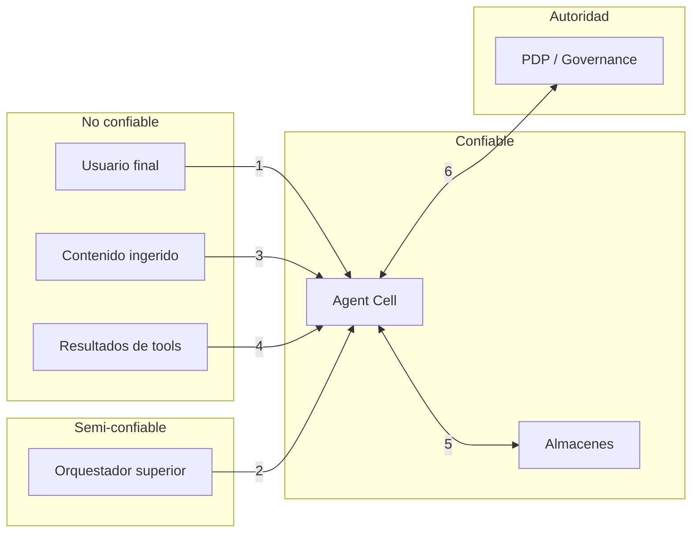

# Modelo de amenazas (STRIDE)

Alcance: la Agent Cell y sus fronteras. Fuera de alcance: la plataforma PEAK (MCP
Gateway, Governance, Audit Ledger), que tiene su propio modelo.

## 1. Fronteras de confianza

**Contenido ingerido y resultados de tools son datos, nunca instrucciones.** Es la
premisa que sostiene el resto del modelo.

## 2. Amenazas y controles

### Spoofing
| Amenaza | Control |
|---|---|
| Suplantación de usuario para elevar el techo de clasificación | Identidad sólo desde JWT/OIDC verificado o header firmado; nunca desde el cuerpo del mensaje. Sin identidad, C0 |
| Webhook falso de Teams/Slack | Verificación de firma obligatoria con ventana temporal; descarte silencioso y registro |
| Orquestador no autorizado invocando MCP/A2A | Autenticación en toda superficie upstream; el orquestador no hereda privilegios |

### Tampering
| Amenaza | Control |
|---|---|
| Manipulación del ledger de evidencia | Hash-chain append-only; `make verify-ledger`; exportación firmada |
| Alteración de prompts en caliente | Registry versionado en el repositorio, promoción manual, sin auto-deploy |
| Modificación de políticas locales | Rego versionado, tests offline, cambio de decisión registrado en el ledger |

### Repudiation
| Amenaza | Control |
|---|---|
| "Yo no aprobé esa acción" | Cada aprobación entra en el ledger con actor, tiempo y digest de la acción; A4 exige dos aprobadores distintos |
| "El agente hizo algo que nadie pidió" | Digest del prompt, decisiones de política, tool calls y veredictos encadenados por hash |

### Information disclosure
| Amenaza | Control |
|---|---|
| **Fuga C3/C4 a modelo externo** | Decisión única en `gateway/model_policy.py` sobre la clasificación **acumulada**; test que recorre todas las rutas |
| Recuperación de documentos sin permiso | Filtro dentro de la consulta al almacén (ADR-004); respuesta indistinguible de corpus vacío |
| Fuga por caché semántica entre usuarios | La entrada de caché guarda techo de clasificación y grupos; sólo sirve a alcance igual o menor |
| Fuga por memoria de área | Scrubbing de PII antes de persistir; los episodios guardan el patrón, no los identificadores |
| Exfiltración por marcado en la salida (URL con datos) | DLP de salida: URLs y data-URIs con carga sospechosa se bloquean |
| Fuga por embeddings enviados fuera | Los embeddings de contenido C2+ se calculan **sólo** en local; nunca se llama a un servicio externo de embeddings |

### Denial of service
| Amenaza | Control |
|---|---|
| Agotamiento de presupuesto de tokens | Budgets por tenant en LiteLLM; contadores en el estado del grafo; corte al superar |
| Bucle de replan infinito | Máximo de reintentos por tarea; superado, escala a HITL |
| Saturación por ingesta | Worker desacoplado por cola con backpressure; límites de CPU/RAM por contenedor |
| Tool colgada | Timeout y circuit breaker en todo I/O externo |

### Elevation of privilege
| Amenaza | Control |
|---|---|
| **Inyección de prompt** desde un documento o resultado de tool | Contenido no confiable se entrega delimitado y etiquetado; DLP de entrada; el `quality_gate` evalúa si la respuesta obedeció instrucciones incrustadas |
| Uso de tool fuera de la allowlist | Allowlist por tenant evaluada dos veces: al construir el catálogo y antes de invocar |
| Escalada de autonomía | Nivel efectivo = máximo(ToolSpec, perfil, PDP). Ninguna capa puede bajarlo |
| SQL arbitrario generado por el LLM | Sólo plantillas parametrizadas allowlisted; conexiones `readonly` por defecto |
| Fail-open al caer la gobernanza | Fail-closed por defecto; C3/C4 y A2+ nunca proceden sin decisión fresca |

## 3. Supuestos

1. El PDP y el Audit Ledger de la plataforma son confiables y su transporte va cifrado.
2. Los operadores con acceso al host pueden leer los almacenes; el aislamiento es entre
   *tenants y usuarios*, no frente a un administrador del host.
3. Los modelos locales no exfiltran: corren en infraestructura propia sin salida a red.
4. Un documento ingerido puede ser hostil, incluso viniendo de una fuente corporativa.

## 4. Riesgos residuales aceptados

| Riesgo | Por qué se acepta | Compensación |
|---|---|---|
| Jailbreaks novedosos no cubiertos por reglas | Un clasificador ML no elimina el riesgo, sólo lo desplaza | `quality_gate`, corpus de regresión con gate en CI, extra `promptguard` |
| Clasificación automática C0–C4 imperfecta en la ingesta | Depende del contenido; el error de clasificar de menos es el peligroso | Default del perfil nunca es C0; override manual; auditoría por muestreo en RUNBOOK |
| Inferencia estadística sobre respuestas permitidas | Inherente a cualquier sistema de preguntas | Registro completo de consultas por usuario para detección posterior |
