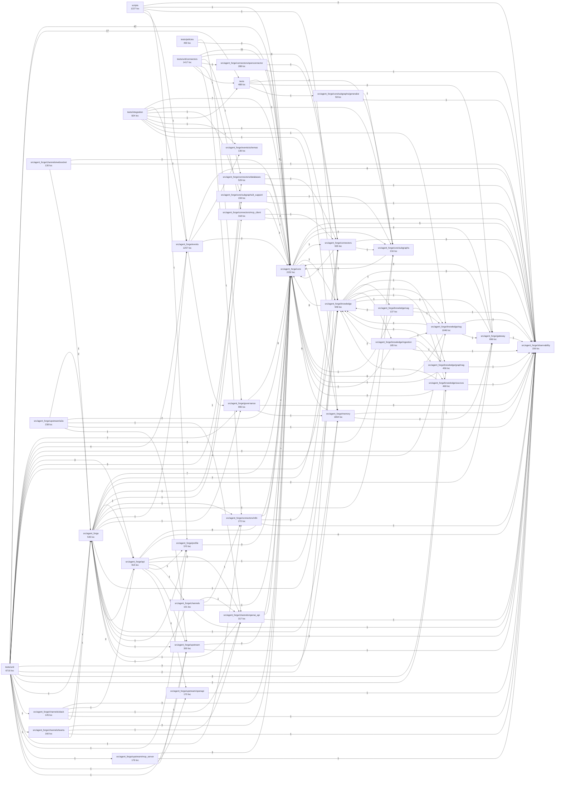

```mermaid
flowchart LR
  scripts["scripts<br/>1227 loc"]
  src_agent_forge["src/agent_forge<br/>535 loc"]
  src_agent_forge_api["src/agent_forge/api<br/>915 loc"]
  src_agent_forge_channels["src/agent_forge/channels<br/>101 loc"]
  src_agent_forge_channels_openai_api["src/agent_forge/channels/openai_api<br/>317 loc"]
  src_agent_forge_channels_slack["src/agent_forge/channels/slack<br/>145 loc"]
  src_agent_forge_channels_teams["src/agent_forge/channels/teams<br/>160 loc"]
  src_agent_forge_channels_websocket["src/agent_forge/channels/websocket<br/>130 loc"]
  src_agent_forge_connectors["src/agent_forge/connectors<br/>935 loc"]
  src_agent_forge_connectors_databases["src/agent_forge/connectors/databases<br/>529 loc"]
  src_agent_forge_connectors_mcp_client["src/agent_forge/connectors/mcp_client<br/>318 loc"]
  src_agent_forge_connectors_n8n["src/agent_forge/connectors/n8n<br/>272 loc"]
  src_agent_forge_connectors_openconnector["src/agent_forge/connectors/openconnector<br/>288 loc"]
  src_agent_forge_core["src/agent_forge/core<br/>2232 loc"]
  src_agent_forge_core_subgraphs["src/agent_forge/core/subgraphs<br/>216 loc"]
  src_agent_forge_core_subgraphs_generalist["src/agent_forge/core/subgraphs/generalist<br/>58 loc"]
  src_agent_forge_core_subgraphs_it_support["src/agent_forge/core/subgraphs/it_support<br/>159 loc"]
  src_agent_forge_events["src/agent_forge/events<br/>1257 loc"]
  src_agent_forge_events_schemas["src/agent_forge/events/schemas<br/>136 loc"]
  src_agent_forge_gateway["src/agent_forge/gateway<br/>696 loc"]
  src_agent_forge_governance["src/agent_forge/governance<br/>995 loc"]
  src_agent_forge_knowledge["src/agent_forge/knowledge<br/>948 loc"]
  src_agent_forge_knowledge_cag["src/agent_forge/knowledge/cag<br/>137 loc"]
  src_agent_forge_knowledge_graphrag["src/agent_forge/knowledge/graphrag<br/>456 loc"]
  src_agent_forge_knowledge_ingestion["src/agent_forge/knowledge/ingestion<br/>185 loc"]
  src_agent_forge_knowledge_rag["src/agent_forge/knowledge/rag<br/>1046 loc"]
  src_agent_forge_knowledge_sources["src/agent_forge/knowledge/sources<br/>469 loc"]
  src_agent_forge_memory["src/agent_forge/memory<br/>1864 loc"]
  src_agent_forge_observability["src/agent_forge/observability<br/>156 loc"]
  src_agent_forge_profile["src/agent_forge/profile<br/>570 loc"]
  src_agent_forge_upstream["src/agent_forge/upstream<br/>300 loc"]
  src_agent_forge_upstream_a2a["src/agent_forge/upstream/a2a<br/>238 loc"]
  src_agent_forge_upstream_mcp_server["src/agent_forge/upstream/mcp_server<br/>176 loc"]
  src_agent_forge_upstream_openapi["src/agent_forge/upstream/openapi<br/>170 loc"]
  tests["tests<br/>488 loc"]
  tests_integration["tests/integration<br/>824 loc"]
  tests_policies["tests/policies<br/>490 loc"]
  tests_unit["tests/unit<br/>6710 loc"]
  tests_unit_connectors["tests/unit/connectors<br/>1417 loc"]
  tests_unit -->|47| src_agent_forge_core
  tests_unit -->|17| tests
  tests_unit_connectors -->|11| src_agent_forge_core
  tests -->|10| src_agent_forge_core
  src_agent_forge_connectors -->|9| src_agent_forge_core
  src_agent_forge_governance -->|9| src_agent_forge_core
  src_agent_forge_memory -->|9| src_agent_forge_core
  src_agent_forge_api -->|8| src_agent_forge_core
  src_agent_forge_knowledge -->|8| src_agent_forge_core
  src_agent_forge_memory -->|7| src_agent_forge_observability
  src_agent_forge -->|7| src_agent_forge_core
  tests_integration -->|7| src_agent_forge_core
  tests_unit -->|7| src_agent_forge_governance
  src_agent_forge_events -->|6| src_agent_forge_observability
  src_agent_forge_knowledge_rag -->|6| src_agent_forge_core
  tests_unit_connectors -->|6| src_agent_forge_connectors
  src_agent_forge_core -->|5| src_agent_forge_observability
  src_agent_forge_core_subgraphs -->|5| src_agent_forge_core
  src_agent_forge_events -->|5| src_agent_forge_events_schemas
  src_agent_forge_api -->|4| src_agent_forge_observability
  src_agent_forge_api -->|4| src_agent_forge
  src_agent_forge_gateway -->|4| src_agent_forge_core
  src_agent_forge_knowledge_rag -->|4| src_agent_forge_knowledge
  tests_unit -->|4| src_agent_forge_core_subgraphs
  tests_unit -->|4| src_agent_forge_events
  tests_unit -->|4| src_agent_forge_gateway
  tests_unit -->|4| src_agent_forge_knowledge_rag
  src_agent_forge_channels_openai_api -->|3| src_agent_forge_core
  src_agent_forge_channels_slack -->|3| src_agent_forge_core
  src_agent_forge_channels_teams -->|3| src_agent_forge_core
  src_agent_forge_connectors -->|3| src_agent_forge_observability
  src_agent_forge_connectors_databases -->|3| src_agent_forge_core
  src_agent_forge_connectors_mcp_client -->|3| src_agent_forge_core
  src_agent_forge_connectors_n8n -->|3| src_agent_forge_core
  src_agent_forge_connectors_openconnector -->|3| src_agent_forge_core
  src_agent_forge_core -->|3| src_agent_forge_gateway
  src_agent_forge_governance -->|3| src_agent_forge_observability
  src_agent_forge_knowledge -->|3| src_agent_forge_observability
  src_agent_forge_knowledge_rag -->|3| src_agent_forge_observability
  src_agent_forge_profile -->|3| src_agent_forge_core
  src_agent_forge_upstream_mcp_server -->|3| src_agent_forge_core
  tests_policies -->|3| src_agent_forge_governance
  tests_unit -->|3| src_agent_forge_api
  tests_unit -->|3| src_agent_forge_core_subgraphs_it_support
  tests_unit -->|3| src_agent_forge_knowledge
  tests_unit -->|3| src_agent_forge_memory
  scripts -->|2| src_agent_forge_observability
  src_agent_forge_api -->|2| src_agent_forge_channels_openai_api
  src_agent_forge_channels_websocket -->|2| src_agent_forge_core
  src_agent_forge_core -->|2| src_agent_forge_core_subgraphs
  src_agent_forge_events -->|2| src_agent_forge_core
  src_agent_forge_knowledge_cag -->|2| src_agent_forge_knowledge
  src_agent_forge_knowledge_graphrag -->|2| src_agent_forge_knowledge
  src_agent_forge_knowledge_ingestion -->|2| src_agent_forge_knowledge
  src_agent_forge_knowledge_ingestion -->|2| src_agent_forge_knowledge_rag
  src_agent_forge_knowledge_sources -->|2| src_agent_forge_core
  src_agent_forge_memory -->|2| src_agent_forge_gateway
  src_agent_forge -->|2| src_agent_forge_connectors
  src_agent_forge -->|2| src_agent_forge_gateway
  src_agent_forge_upstream_a2a -->|2| src_agent_forge
  src_agent_forge_upstream_a2a -->|2| src_agent_forge_core
  src_agent_forge_upstream -->|2| src_agent_forge_core
  tests -->|2| src_agent_forge_core_subgraphs
  tests_integration -->|2| src_agent_forge_events
  tests_policies -->|2| src_agent_forge_core
  tests -->|2| src_agent_forge_gateway
  tests_unit -->|2| src_agent_forge_connectors
  tests_unit -->|2| src_agent_forge_knowledge_graphrag
  tests_unit -->|2| src_agent_forge_knowledge_sources
  scripts -->|1| src_agent_forge_core
  scripts -->|1| src_agent_forge_knowledge
  scripts -->|1| src_agent_forge_profile
  scripts -->|1| src_agent_forge_events
  src_agent_forge_api -->|1| src_agent_forge_knowledge
  src_agent_forge_api -->|1| src_agent_forge_channels
  src_agent_forge_api -->|1| src_agent_forge_profile
  src_agent_forge_api -->|1| src_agent_forge_upstream
  src_agent_forge_api -->|1| src_agent_forge_upstream_openapi
  src_agent_forge_channels -->|1| src_agent_forge_channels_openai_api
  src_agent_forge_channels -->|1| src_agent_forge_connectors_n8n
  src_agent_forge_channels -->|1| src_agent_forge_core
  src_agent_forge_channels -->|1| src_agent_forge_observability
  src_agent_forge_channels -->|1| src_agent_forge
  src_agent_forge_channels_openai_api -->|1| src_agent_forge_observability
  src_agent_forge_channels_openai_api -->|1| src_agent_forge
  src_agent_forge_channels_slack -->|1| src_agent_forge_api
  src_agent_forge_channels_slack -->|1| src_agent_forge_channels_openai_api
  src_agent_forge_channels_slack -->|1| src_agent_forge_observability
  src_agent_forge_channels_slack -->|1| src_agent_forge
  src_agent_forge_channels_teams -->|1| src_agent_forge_channels_openai_api
  src_agent_forge_channels_teams -->|1| src_agent_forge_observability
  src_agent_forge_channels_teams -->|1| src_agent_forge
  src_agent_forge_channels_websocket -->|1| src_agent_forge_observability
  src_agent_forge_channels_websocket -->|1| src_agent_forge
  src_agent_forge_connectors_databases -->|1| src_agent_forge_connectors
  src_agent_forge_connectors_databases -->|1| src_agent_forge_observability
  src_agent_forge_connectors_mcp_client -->|1| src_agent_forge_connectors
  src_agent_forge_connectors_mcp_client -->|1| src_agent_forge_observability
  src_agent_forge_connectors_n8n -->|1| src_agent_forge_connectors
  src_agent_forge_connectors_n8n -->|1| src_agent_forge_observability
  src_agent_forge_connectors_openconnector -->|1| src_agent_forge_connectors
  src_agent_forge_connectors_openconnector -->|1| src_agent_forge_observability
  src_agent_forge_connectors -->|1| src_agent_forge_core_subgraphs
  src_agent_forge_core -->|1| src_agent_forge_connectors
  src_agent_forge_core -->|1| src_agent_forge_knowledge
  src_agent_forge_core -->|1| src_agent_forge_memory
  src_agent_forge_core_subgraphs_generalist -->|1| src_agent_forge_core_subgraphs
  src_agent_forge_core_subgraphs_generalist -->|1| src_agent_forge_observability
  src_agent_forge_core_subgraphs_it_support -->|1| src_agent_forge_core
  src_agent_forge_core_subgraphs_it_support -->|1| src_agent_forge_core_subgraphs
  src_agent_forge_core_subgraphs_it_support -->|1| src_agent_forge_observability
  src_agent_forge_events -->|1| src_agent_forge_governance
  src_agent_forge_gateway -->|1| src_agent_forge_observability
  src_agent_forge_governance -->|1| src_agent_forge_memory
  src_agent_forge_knowledge -->|1| src_agent_forge_knowledge_cag
  src_agent_forge_knowledge -->|1| src_agent_forge_knowledge_graphrag
  src_agent_forge_knowledge -->|1| src_agent_forge_knowledge_ingestion
  src_agent_forge_knowledge -->|1| src_agent_forge_knowledge_rag
  src_agent_forge_knowledge -->|1| src_agent_forge_knowledge_sources
  src_agent_forge_knowledge_cag -->|1| src_agent_forge_core
  src_agent_forge_knowledge_cag -->|1| src_agent_forge_knowledge_rag
  src_agent_forge_knowledge_cag -->|1| src_agent_forge_observability
  src_agent_forge_knowledge -->|1| src_agent_forge_gateway
  src_agent_forge_knowledge_graphrag -->|1| src_agent_forge_core
  src_agent_forge_knowledge_graphrag -->|1| src_agent_forge_observability
  src_agent_forge_knowledge_ingestion -->|1| src_agent_forge_core
  src_agent_forge_knowledge_ingestion -->|1| src_agent_forge_knowledge_graphrag
  src_agent_forge_knowledge_ingestion -->|1| src_agent_forge_knowledge_sources
  src_agent_forge_knowledge_ingestion -->|1| src_agent_forge_observability
  src_agent_forge_knowledge_rag -->|1| src_agent_forge_gateway
  src_agent_forge_knowledge_sources -->|1| src_agent_forge_knowledge
  src_agent_forge_knowledge_sources -->|1| src_agent_forge_observability
  src_agent_forge -->|1| src_agent_forge_api
  src_agent_forge -->|1| src_agent_forge_connectors_databases
  src_agent_forge -->|1| src_agent_forge_connectors_mcp_client
  src_agent_forge -->|1| src_agent_forge_connectors_n8n
  src_agent_forge -->|1| src_agent_forge_core_subgraphs
  src_agent_forge -->|1| src_agent_forge_events
  src_agent_forge -->|1| src_agent_forge_governance
  src_agent_forge -->|1| src_agent_forge_knowledge
  src_agent_forge -->|1| src_agent_forge_memory
  src_agent_forge -->|1| src_agent_forge_observability
  src_agent_forge -->|1| src_agent_forge_profile
  src_agent_forge -->|1| src_agent_forge_upstream
  src_agent_forge_upstream_a2a -->|1| src_agent_forge_channels_openai_api
  src_agent_forge_upstream_a2a -->|1| src_agent_forge_observability
  src_agent_forge_upstream_a2a -->|1| src_agent_forge_upstream
  src_agent_forge_upstream_mcp_server -->|1| src_agent_forge_observability
  src_agent_forge_upstream_mcp_server -->|1| src_agent_forge_upstream
  src_agent_forge_upstream_openapi -->|1| src_agent_forge_observability
  src_agent_forge_upstream -->|1| src_agent_forge_observability
  tests_integration -->|1| src_agent_forge_core_subgraphs
  tests_integration -->|1| src_agent_forge_core_subgraphs_it_support
  tests_integration -->|1| tests
  tests_integration -->|1| src_agent_forge_events_schemas
  tests_integration -->|1| src_agent_forge_knowledge
  tests_integration -->|1| src_agent_forge_knowledge_rag
  tests_integration -->|1| src_agent_forge_memory
  tests -->|1| src_agent_forge_core_subgraphs_generalist
  tests_unit_connectors -->|1| src_agent_forge_connectors_databases
  tests_unit_connectors -->|1| src_agent_forge_connectors_openconnector
  tests_unit_connectors -->|1| src_agent_forge_connectors_mcp_client
  tests_unit_connectors -->|1| src_agent_forge_connectors_n8n
  tests_unit_connectors -->|1| tests
  tests_unit -->|1| src_agent_forge
  tests_unit -->|1| src_agent_forge_channels_slack
  tests_unit -->|1| src_agent_forge_channels_teams
  tests_unit -->|1| src_agent_forge_connectors_n8n
  tests_unit -->|1| src_agent_forge_profile
  tests_unit -->|1| src_agent_forge_upstream_mcp_server
  tests_unit -->|1| src_agent_forge_upstream_openapi
  tests_unit -->|1| src_agent_forge_upstream
```
