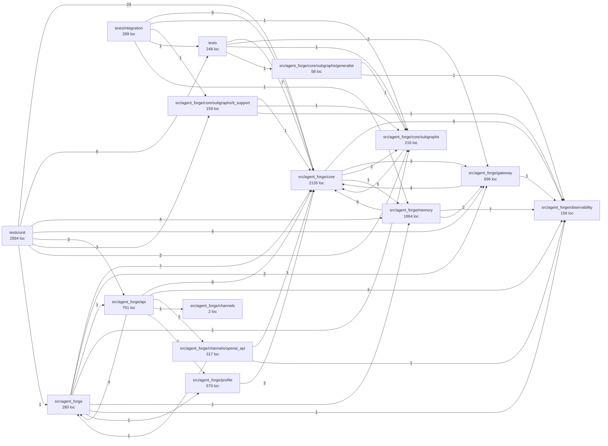

```mermaid
flowchart LR
  src_agent_forge["src/agent_forge<br/>280 loc"]
  src_agent_forge_api["src/agent_forge/api<br/>751 loc"]
  src_agent_forge_channels["src/agent_forge/channels<br/>2 loc"]
  src_agent_forge_channels_openai_api["src/agent_forge/channels/openai_api<br/>317 loc"]
  src_agent_forge_core["src/agent_forge/core<br/>2135 loc"]
  src_agent_forge_core_subgraphs["src/agent_forge/core/subgraphs<br/>216 loc"]
  src_agent_forge_core_subgraphs_generalist["src/agent_forge/core/subgraphs/generalist<br/>58 loc"]
  src_agent_forge_core_subgraphs_it_support["src/agent_forge/core/subgraphs/it_support<br/>159 loc"]
  src_agent_forge_gateway["src/agent_forge/gateway<br/>696 loc"]
  src_agent_forge_memory["src/agent_forge/memory<br/>1864 loc"]
  src_agent_forge_observability["src/agent_forge/observability<br/>156 loc"]
  src_agent_forge_profile["src/agent_forge/profile<br/>570 loc"]
  tests["tests<br/>248 loc"]
  tests_integration["tests/integration<br/>289 loc"]
  tests_unit["tests/unit<br/>2694 loc"]
  tests_unit -->|24| src_agent_forge_core
  src_agent_forge_memory -->|9| src_agent_forge_core
  src_agent_forge_api -->|8| src_agent_forge_core
  src_agent_forge_memory -->|7| src_agent_forge_observability
  src_agent_forge -->|7| src_agent_forge_core
  tests -->|7| src_agent_forge_core
  tests_unit -->|6| tests
  src_agent_forge_core -->|5| src_agent_forge_observability
  src_agent_forge_core_subgraphs -->|5| src_agent_forge_core
  tests_integration -->|5| src_agent_forge_core
  src_agent_forge_api -->|4| src_agent_forge_observability
  src_agent_forge_api -->|4| src_agent_forge
  src_agent_forge_gateway -->|4| src_agent_forge_core
  tests_unit -->|4| src_agent_forge_memory
  tests_unit -->|4| src_agent_forge_gateway
  src_agent_forge_channels_openai_api -->|3| src_agent_forge_core
  src_agent_forge_core -->|3| src_agent_forge_gateway
  src_agent_forge_profile -->|3| src_agent_forge_core
  tests_unit -->|3| src_agent_forge_api
  tests_unit -->|3| src_agent_forge_core_subgraphs_it_support
  src_agent_forge_api -->|2| src_agent_forge_channels_openai_api
  src_agent_forge_core -->|2| src_agent_forge_core_subgraphs
  src_agent_forge_memory -->|2| src_agent_forge_gateway
  src_agent_forge -->|2| src_agent_forge_gateway
  tests -->|2| src_agent_forge_gateway
  tests_unit -->|2| src_agent_forge_core_subgraphs
  src_agent_forge_api -->|1| src_agent_forge_channels
  src_agent_forge_api -->|1| src_agent_forge_profile
  src_agent_forge_channels_openai_api -->|1| src_agent_forge_observability
  src_agent_forge_channels_openai_api -->|1| src_agent_forge
  src_agent_forge_core -->|1| src_agent_forge_memory
  src_agent_forge_core_subgraphs_generalist -->|1| src_agent_forge_core_subgraphs
  src_agent_forge_core_subgraphs_generalist -->|1| src_agent_forge_observability
  src_agent_forge_core_subgraphs_it_support -->|1| src_agent_forge_core
  src_agent_forge_core_subgraphs_it_support -->|1| src_agent_forge_core_subgraphs
  src_agent_forge_core_subgraphs_it_support -->|1| src_agent_forge_observability
  src_agent_forge_gateway -->|1| src_agent_forge_observability
  src_agent_forge -->|1| src_agent_forge_api
  src_agent_forge -->|1| src_agent_forge_core_subgraphs
  src_agent_forge -->|1| src_agent_forge_memory
  src_agent_forge -->|1| src_agent_forge_observability
  src_agent_forge -->|1| src_agent_forge_profile
  tests_integration -->|1| src_agent_forge_core_subgraphs
  tests_integration -->|1| src_agent_forge_core_subgraphs_it_support
  tests_integration -->|1| tests
  tests_integration -->|1| src_agent_forge_memory
  tests -->|1| src_agent_forge_core_subgraphs
  tests -->|1| src_agent_forge_core_subgraphs_generalist
  tests_unit -->|1| src_agent_forge
```
